**Architecture (clear mental model)**

- **ALB (HTTP :80)**

- **3 Target Groups**

  - tg-home → 2 EC2 (NGINX home page /)

  - tg-laptop → 2 EC2 (NGINX /laptop)

  - tg-mobile → 2 EC2 (NGINX /mobile)

- **Path-based routing**

  - / → home TG (default)

  - /laptop\* → laptop TG

  - /mobile\* → mobile TG

**STEP 1: Launch EC2 Instances (6 total)**

**Common settings for ALL 6**

- **Region**: ap-south-1

- **AMI**: Ubuntu Server 22.04 LTS

- **Instance type**: t3.micro

- **Key pair**: your choice

- **Network**: default VPC

- **Subnet**: default (any)

- **Auto-assign public IP**: Enabled

- **Security Group**:

  - Inbound:

    - HTTP 80 from 0.0.0.0/0

    - SSH 22 from **your IP only**

**USER DATA (CRITICAL)**

**Home page instances (2 EC2)**

#!/bin/bash

apt update -y

apt install nginx -y

echo \"\<h1\>HOME PAGE\</h1\>\<p\>Served from \$(hostname)\</p\>\" \>
/var/www/html/index.html

systemctl enable nginx

systemctl restart nginx

{width="2.2472222222222222in"
height="9.693055555555556in"}

**Laptop page instances (2 EC2)**

#!/bin/bash

apt update -y

apt install nginx -y

mkdir -p /var/www/html/laptop

echo \"\<h1\>LAPTOP PAGE\</h1\>\<p\>Served from \$(hostname)\</p\>\" \>
/var/www/html/laptop/index.html

systemctl enable nginx

systemctl restart nginx

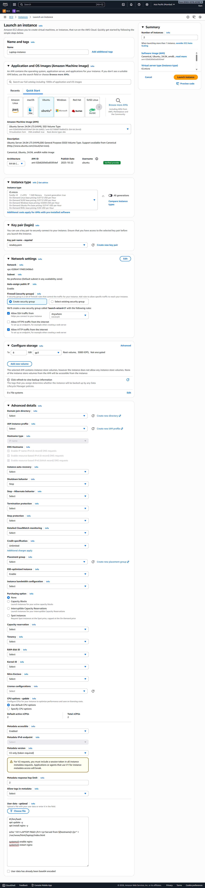{width="2.2472222222222222in"
height="9.693055555555556in"}

**Mobile page instances (2 EC2)**

#!/bin/bash

apt update -y

apt install nginx -y

mkdir -p /var/www/html/mobile

echo \"\<h1\>MOBILE PAGE\</h1\>\<p\>Served from \$(hostname)\</p\>\" \>
/var/www/html/mobile/index.html

systemctl enable nginx

systemctl restart nginx

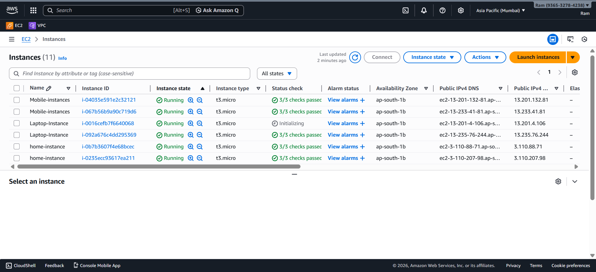{width="6.268055555555556in"
height="2.8666666666666667in"}

✅ Do **not** change NGINX config files. Default config already serves
paths correctly.

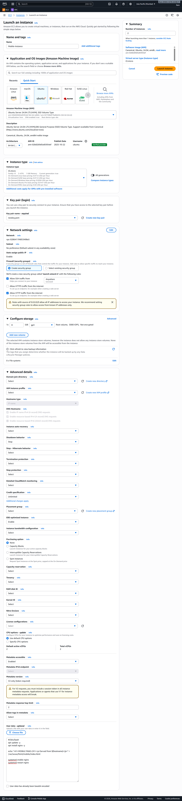{width="2.2152777777777777in"
height="9.693055555555556in"}

**STEP 2: Create Target Groups (3)**

Go to **EC2 → Target Groups → Create target group**

**Target Group 1: Home-tg**

- Type: Instances

- Name: tg-home

- Protocol: HTTP

- Port: 80

- VPC: default VPC

- Health check path: /

➡ Register **2 home EC2 instances**

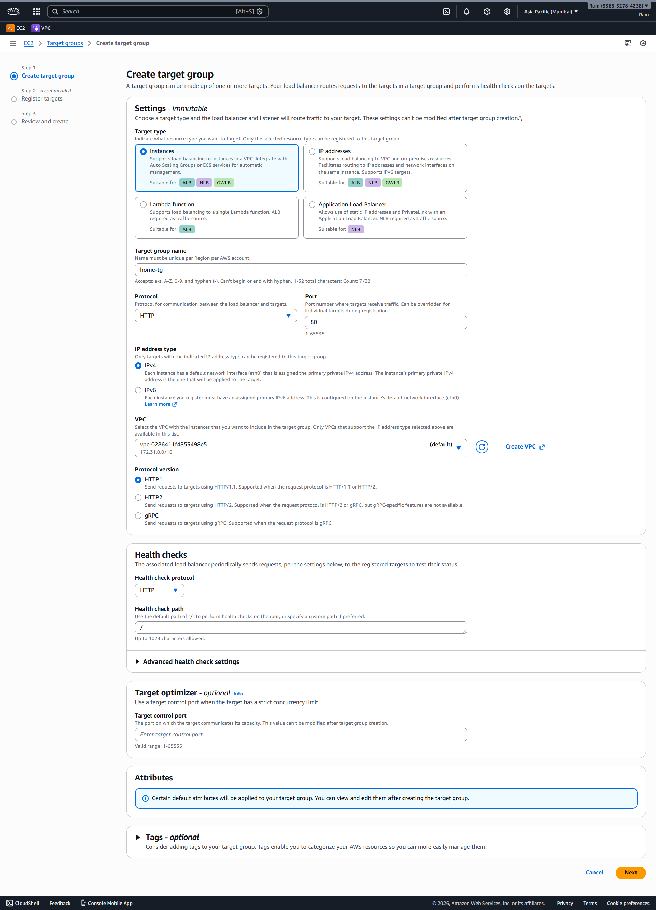{width="6.268055555555556in"
height="8.690277777777778in"}

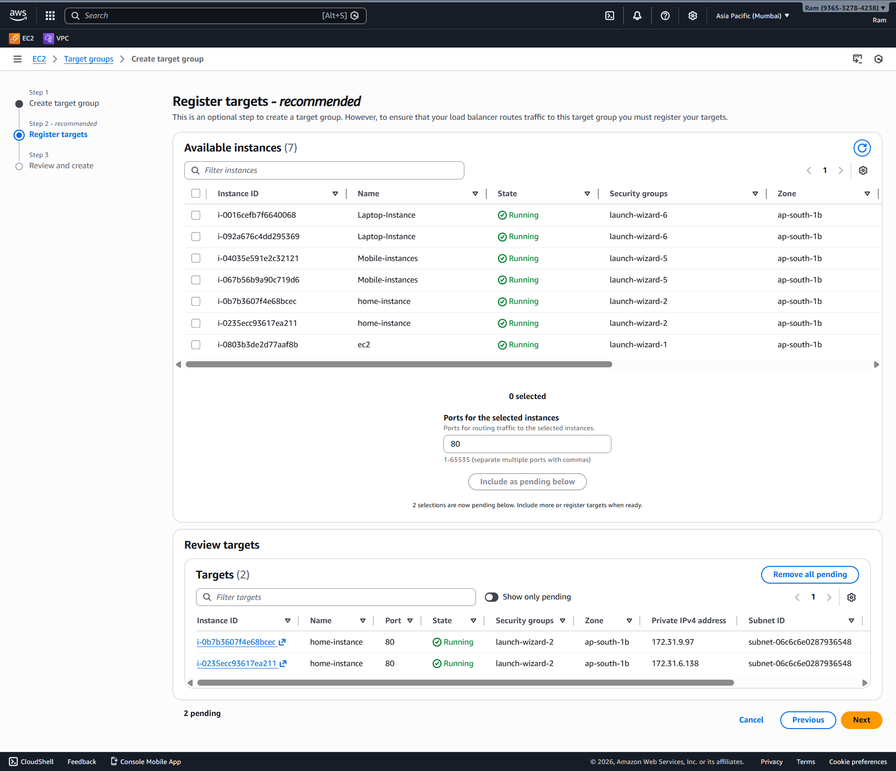{width="6.268055555555556in" height="5.4in"}

**Target Group 2: Laptop**

- Name: tg-laptop

- Protocol: HTTP

- Port: 80

- Health check path: /laptop/

➡ Register **2 laptop EC2 instances**

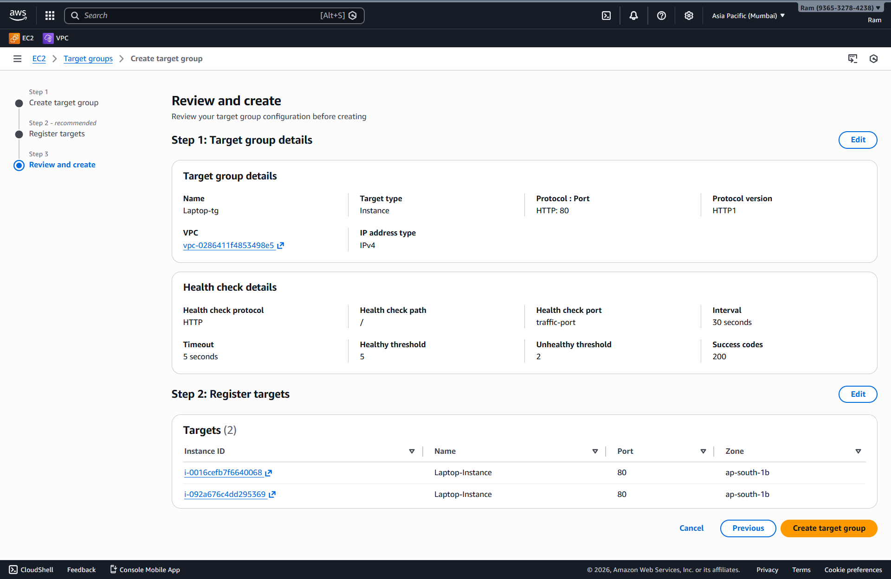{width="6.268055555555556in"
height="4.0777777777777775in"}

**Target Group 3: Mobile**

- Name: tg-mobile

- Protocol: HTTP

- Port: 80

- Health check path: /mobile/

➡ Register **2 mobile EC2 instances**

{width="6.268055555555556in"
height="4.0777777777777775in"}

⚠️ Wait until **all targets show "healthy"**

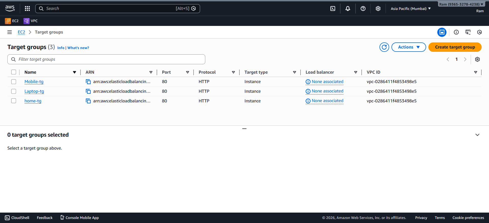{width="6.268055555555556in"
height="2.8666666666666667in"}

**STEP 3: Create Application Load Balancer**

Go to **EC2 → Load Balancers → Create Load Balancer**

- Type: **Application Load Balancer**

- Name: alb-path-demo

- Scheme: Internet-facing

- IP type: IPv4

**Network**

- VPC: default

- Subnets: select **at least 2**

**Security Group**

- Allow **HTTP 80** from 0.0.0.0/0

- 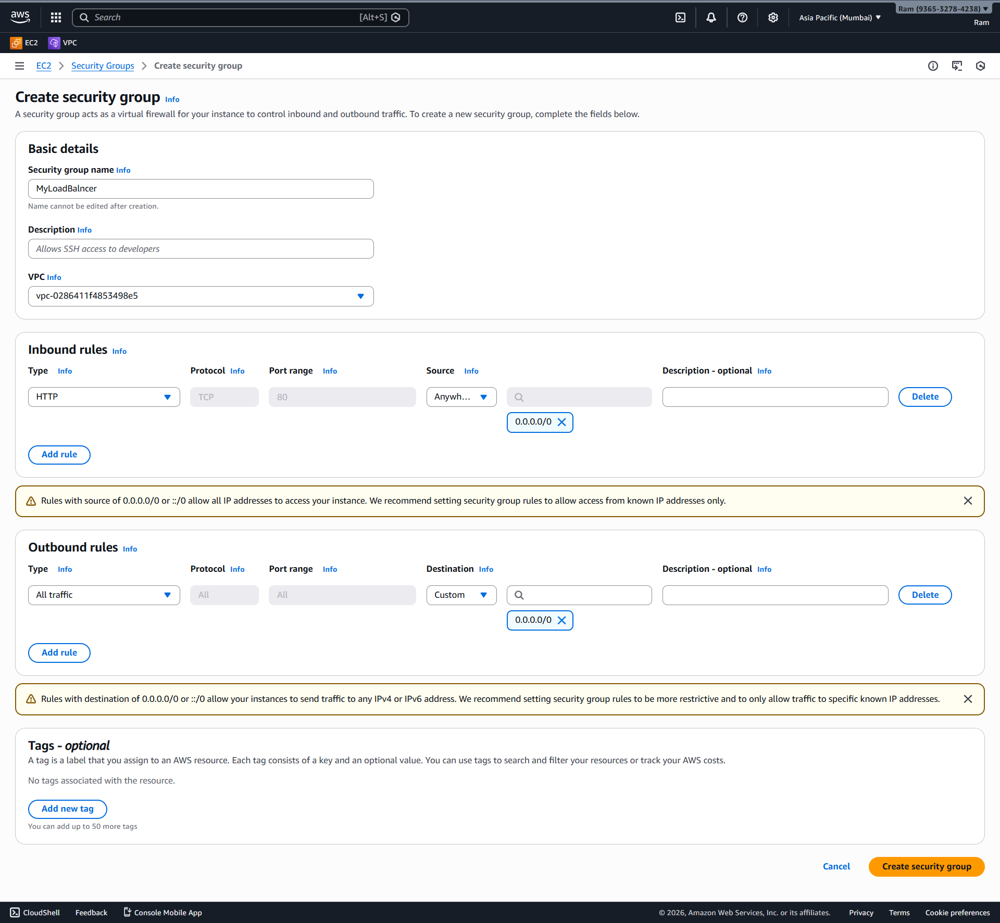{width="6.268055555555556in"
  height="5.791666666666667in"}

**Listener (default)**

- HTTP :80

- Default action: **Forward to tg-home**

Create ALB.

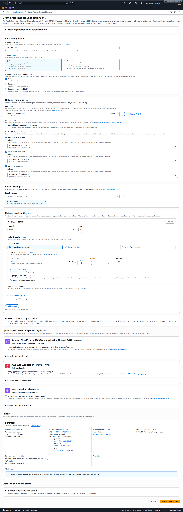{width="3.4784722222222224in"
height="9.693055555555556in"}

{width="6.268055555555556in"
height="2.202777777777778in"}

**STEP 4: Configure Path-Based Routing (MOST IMPORTANT)**

Go to:\
**EC2 → Load Balancers → alb-path-demo → Listeners and Rules → HTTP :80
→ View/Edit rules**

{width="6.268055555555556in"
height="0.6027777777777777in"}

**Rule 1: Laptop**

- Add rule

- IF:

  - Path = /laptop\*

- THEN:

  - Forward to tg-laptop

- Priority: auto (lower number than mobile)

> {width="5.14459208223972in"
> height="5.471757436570429in"}

**Rule 2: Mobile**

- Add rule

- IF:

  - Path = /mobile\*

- THEN:

> 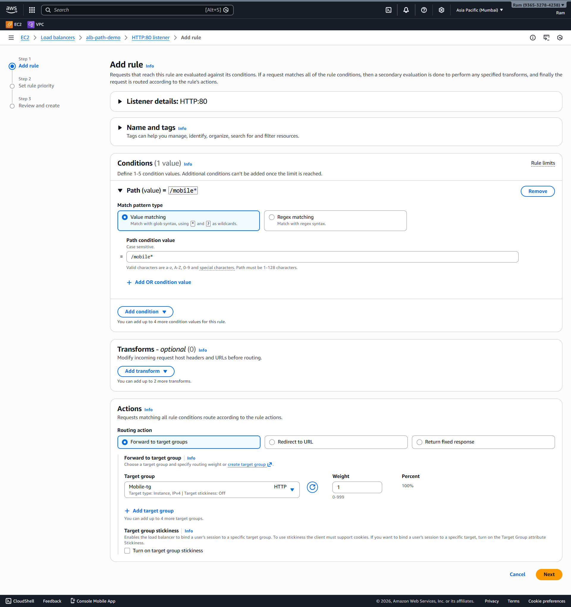{width="6.268055555555556in"
> height="6.666666666666667in"}Forward to tg-mobile

**Default Rule**

- Forward to tg-home

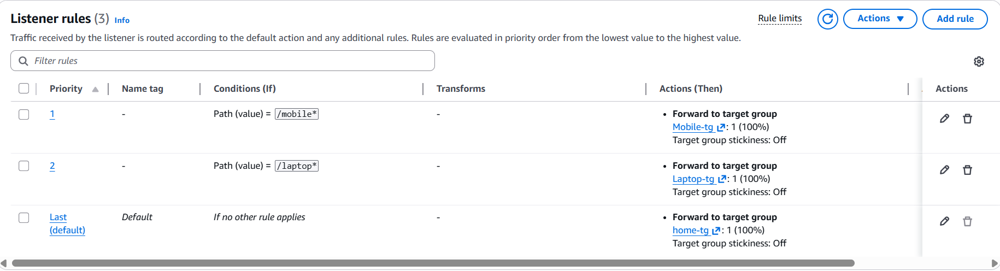{width="6.268055555555556in"
height="1.698611111111111in"}

Save rules.

**STEP 5: Test (THIS IS HOW YOU VERIFY)**

Get **ALB DNS name**, then open:

- http://ALB-DNS/\
  → HOME PAGE

> 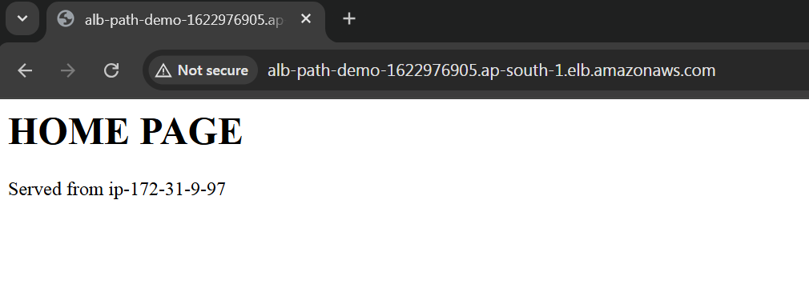{width="6.268055555555556in"
> height="2.202777777777778in"}
>
> 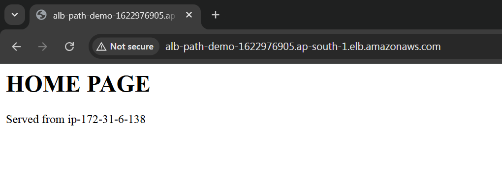{width="6.268055555555556in"
> height="2.16875in"}

- http://ALB-DNS/laptop\
  → LAPTOP PAGE (rotates between 2 laptop EC2s)
  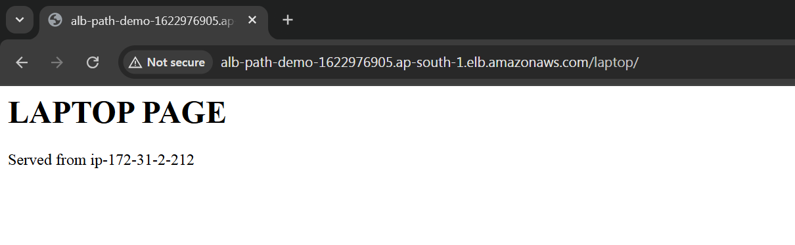{width="6.268055555555556in"
  height="1.9319444444444445in"}

> {width="6.268055555555556in"
> height="1.3604166666666666in"}

- http://ALB-DNS/mobile\
  → MOBILE PAGE (rotates between 2 mobile EC2s)

> 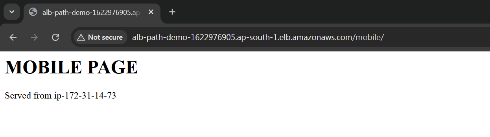{width="6.268055555555556in"
> height="1.7555555555555555in"}
>
> 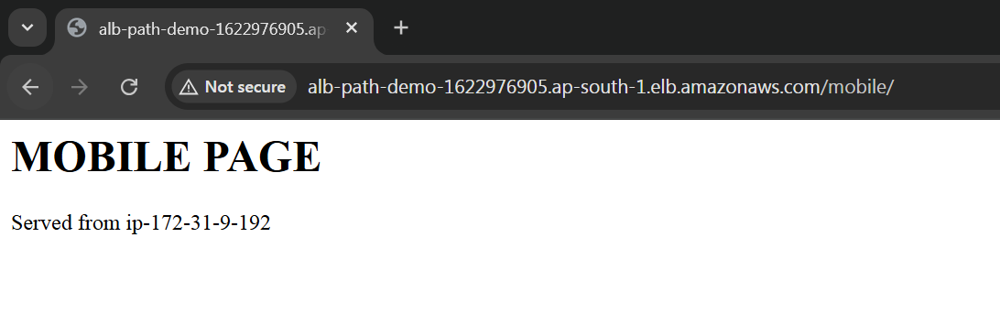{width="6.268055555555556in"
> height="2.0319444444444446in"}

Refresh multiple times to confirm load balancing (hostname changes).
