# PROJECT OVERVIEW
This project builds a **highly available, path-based routed web architecture** in **ap-south-1** using:
- A **custom VPC** with public and private subnets across **3 AZs**
- An **Internet-facing ALB** in public subnets
- **3 separate Auto Scaling Groups** in private subnets, each serving a different path:
  - `/`        → Home ASG
  - `/laptop*` → Laptop ASG
  - `/mobile*` → Mobile ASG
- **Step scaling** based on CPU utilization using **CloudWatch alarms**
- **Ubuntu AMI** with NGINX, customized per ASG via separate Launch Templates

This ensures **fault tolerance**, **independent scaling**, and **clean traffic routing**.


--------------------------------------------------
REGION & AZs
--------------------------------------------------
Region: ap-south-1  
AZs: ap-south-1a, ap-south-1b, ap-south-1c  

--------------------------------------------------
1. CREATE VPC
--------------------------------------------------
VPC → Create VPC
- Name: MS-VPC
- CIDR: 10.0.0.0/16
- Tenancy: Default
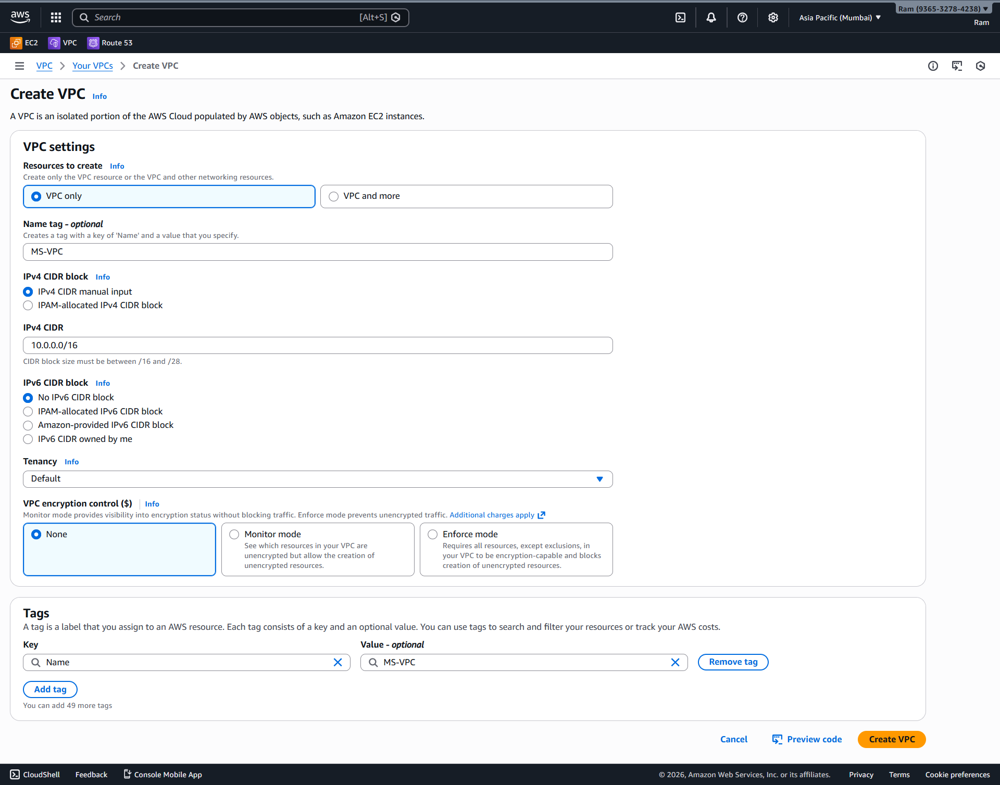


--------------------------------------------------
1. CREATE & ATTACH IGW
--------------------------------------------------
VPC → Internet Gateways → Create
- Name: MS-IGW

Attach to <b>VPC → MS-VPC </b>
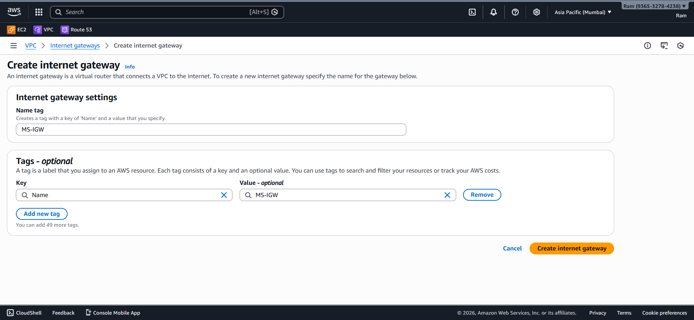
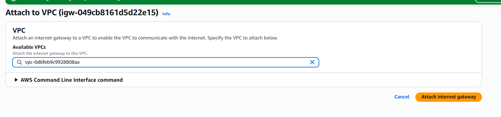

--------------------------------------------------
1. CREATE SUBNETS (3 AZs)
--------------------------------------------------

PUBLIC-SUBNET-MS
- Availability Zone = no preference
- Cidr Block = 10.0.1.0/24
- vpc = MS-VPC

PRIVATE-SUBNET-MS
- Availability Zone = no preference
- Cidr Block = 10.0.0.0/24
- vpc = MS-VPC
  
You can create one subnet for public and private each az and that is more recommended here

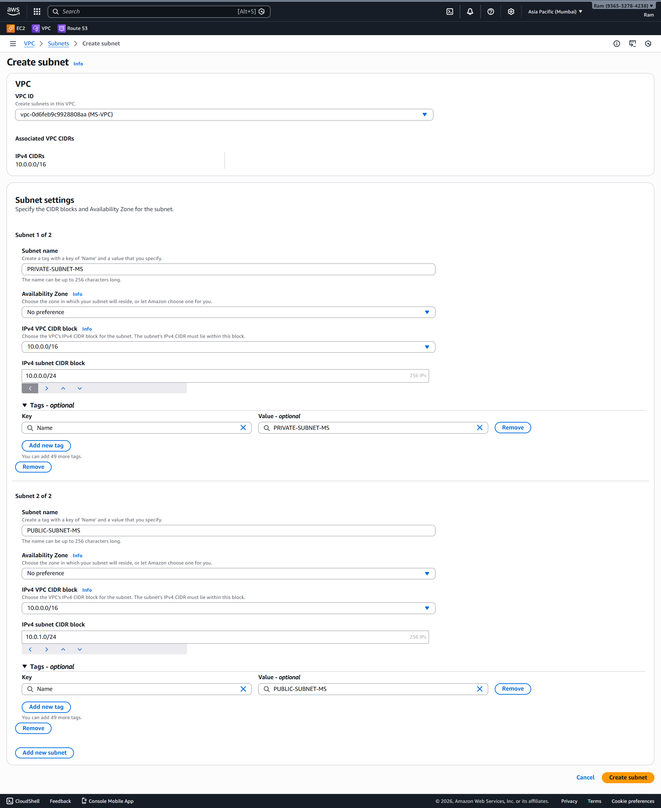


--------------------------------------------------
1. NAT GATEWAY
--------------------------------------------------

MS-NAT
- Zonal
- Subnet = PUBLIC-SUBMET-MS
- Allocate Elastic ip
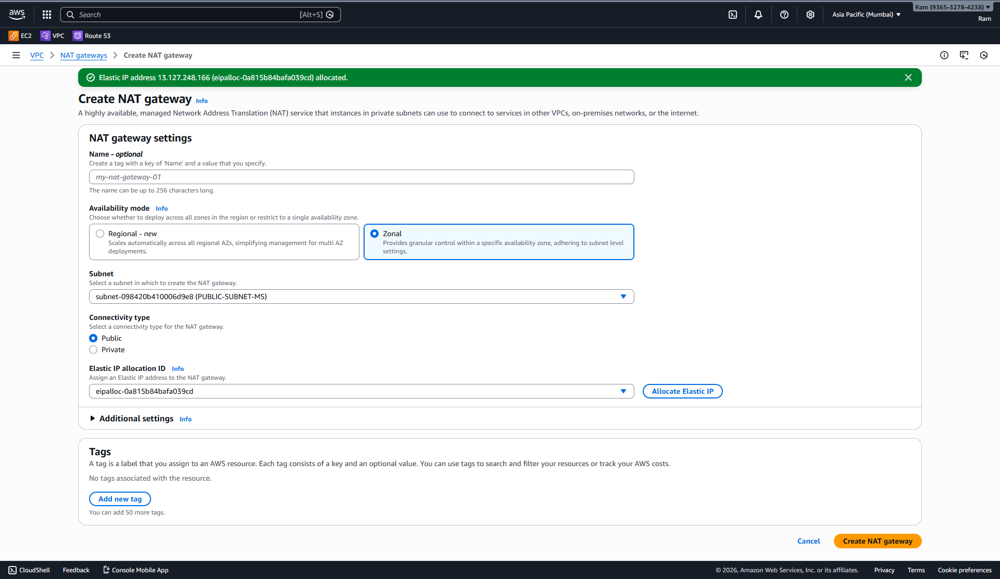


--------------------------------------------------
1. ROUTE TABLES
--------------------------------------------------

PUBLIC RT
- Route: 0.0.0.0/0 → IGW
  - 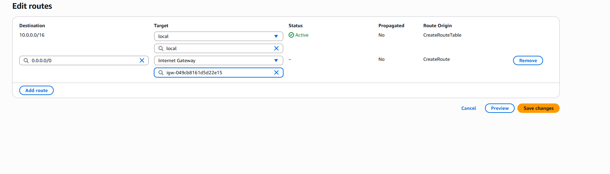
- Associate: all public subnets
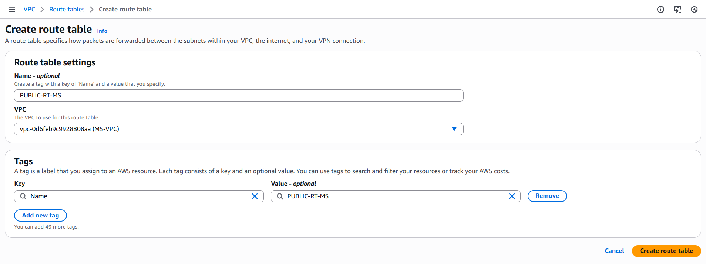

PRIVATE RT
- Route: 0.0.0.0/0 -> Nat Gateways
  - 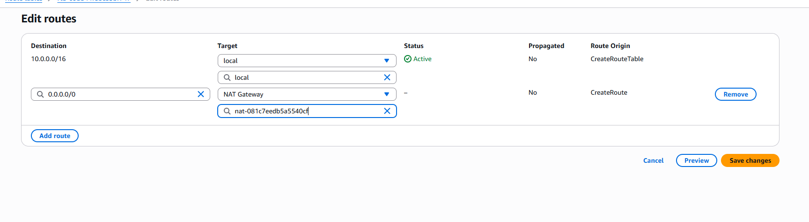
- Associate: all private subnets
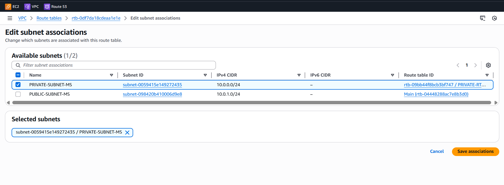


--------------------------------------------------
1. SECURITY GROUPS
--------------------------------------------------

ALB SG
- Inbound: HTTP 80 from 0.0.0.0/0
- Outbound: All
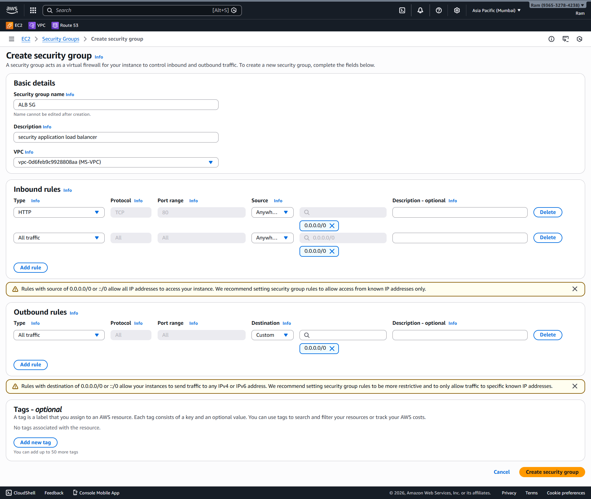

EC2 SG
- Inbound: HTTP 80 from ALB SG
- Outbound: All
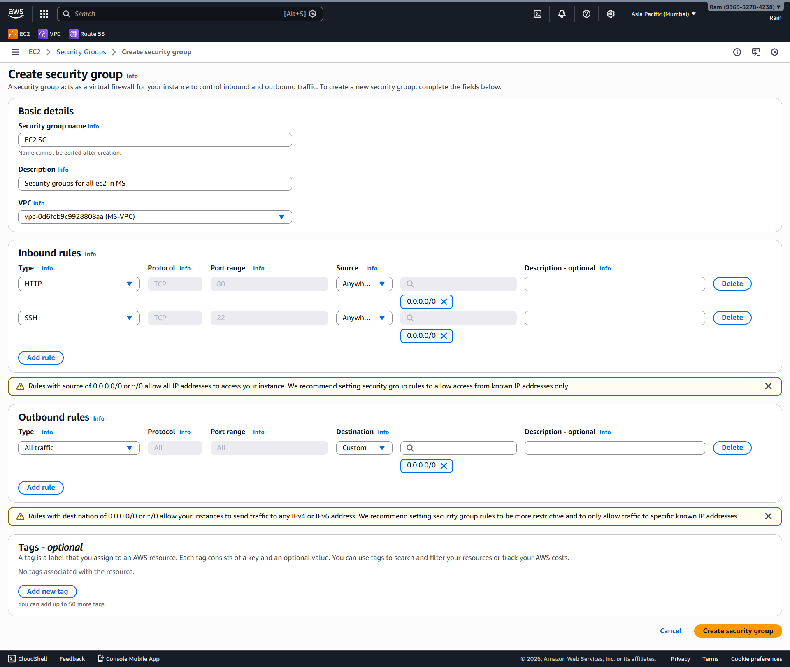

--------------------------------------------------
1. LAUNCH TEMPLATE — HOME ASG
--------------------------------------------------
EC2 → Launch Templates → Create

- Name: lt-home
- AMI: Ubuntu Server 22.04
- Instance type: t3.micro
- SG: EC2 SG


User Data:
```bash
#!/bin/bash
apt update -y
apt install nginx -y
systemctl start nginx
systemctl enable nginx
echo "<h1>HOME PAGE</h1> <p> This is hosted from $(hostname)</p>" > /var/www/html/index.html
systemctl enable nginx
systemctl restart nginx
```


--------------------------------------------------
7. LAUNCH TEMPLATE — LAPTOP ASG
--------------------------------------------------
- Name: lt-laptop
- Same AMI / instance / SG

User Data:

```bash
#!/bin/bash
apt update -y
apt install nginx -y
systemctl start nginx
systemctl enable nginx
mkdir -p /var/www/html/laptop
echo "<h1>LAPTOP PAGE</h1> <p> This is hosted from $(hostname)</p>" > /var/www/html/laptop/index.html
systemctl enable nginx
systemctl restart nginx
```

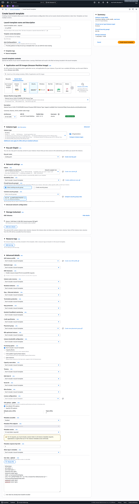
--------------------------------------------------
8. LAUNCH TEMPLATE — MOBILE ASG
--------------------------------------------------
- Name: lt-mobile

User Data:

```bash
#!/bin/bash
apt update -y
apt install nginx -y
systemctl start nginx
systemctl enable nginx
mkdir -p /var/www/html/mobile
echo "<h1>MOBILE PAGE</h1> <p> This is hosted from $(hostname)</p>" > /var/www/html/mobile/index.html
systemctl enable nginx
systemctl restart nginx
```

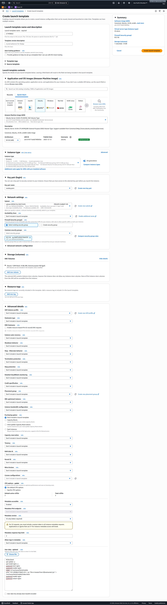

--------------------------------------------------
1. AUTO SCALING GROUPS (PRIVATE SUBNETS)
--------------------------------------------------

COMMON
- Min: 1
- Desired: 2
- Max: 5
- Subnets: private-1a,1b,1c
- Health check: EC2
- Metrics: Enabled

ASG 1
- Name: asg-home
- Launch template: lt-home

ASG 2
- Name: asg-laptop
- Launch template: lt-laptop

ASG 3
- Name: asg-mobile
- Launch template: lt-mobile


---
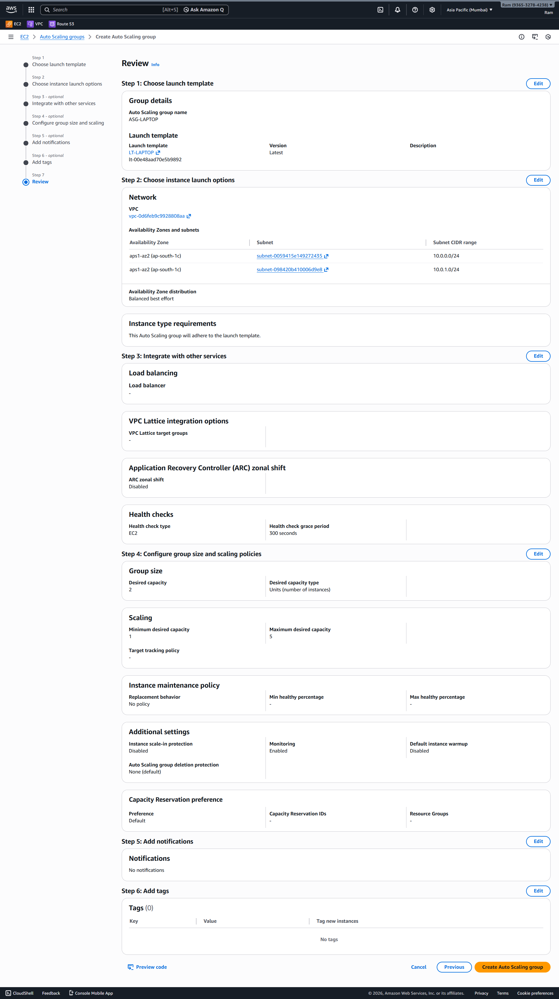
---
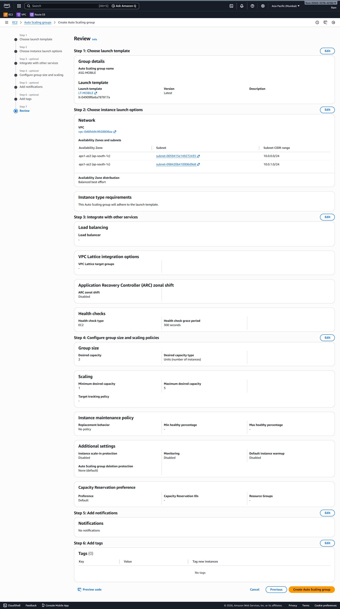


--------------------------------------------------
1.  CLOUDWATCH ALARMS (PER ASG)
--------------------------------------------------

Scale OUT Alarm
- Metric: CPUUtilization
- Dimension: AutoScalingGroupName
- Condition: > 80%
- Period: 1 minute
- Action: Scale-OUT policy

Scale IN Alarm
- Condition: < 20%
- Period: 1 minute
- Action: Scale-IN policy

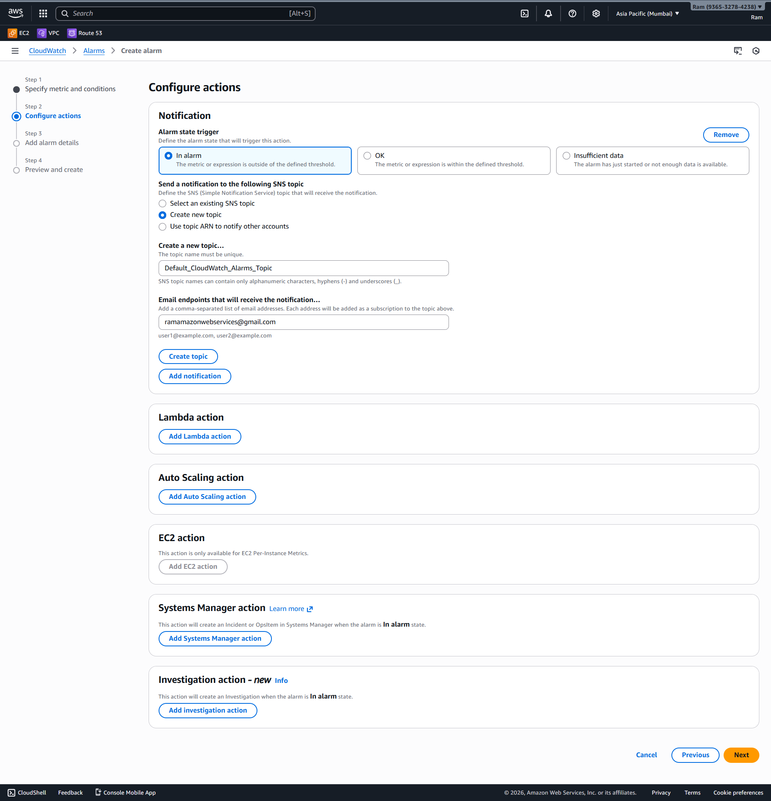
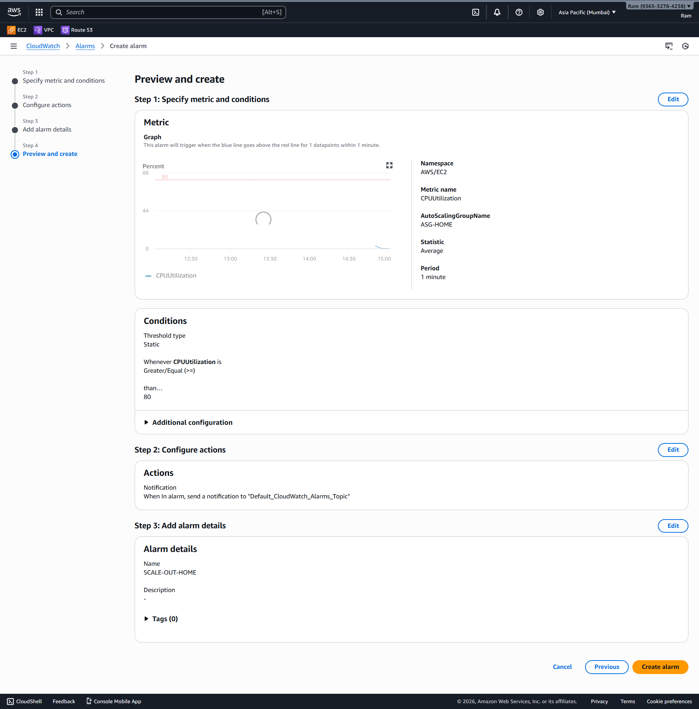


<b> TOTAL 6 ALARMS</b>
s


--------------------------------------------------
1.  STEP SCALING POLICIES (EACH ASG)
--------------------------------------------------

Scale OUT
- Policy type: Step scaling
- Action: +1 instance
- Cooldown: 60s


Scale IN
- Policy type: Step scaling
- Action: -1 instance
- Cooldown: 60s


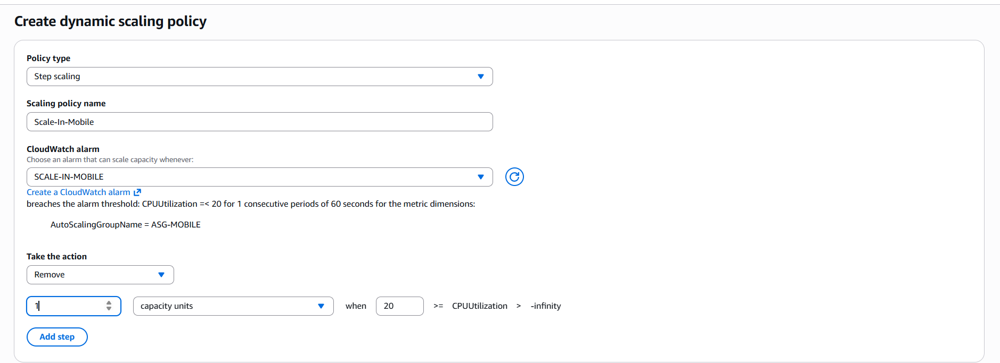
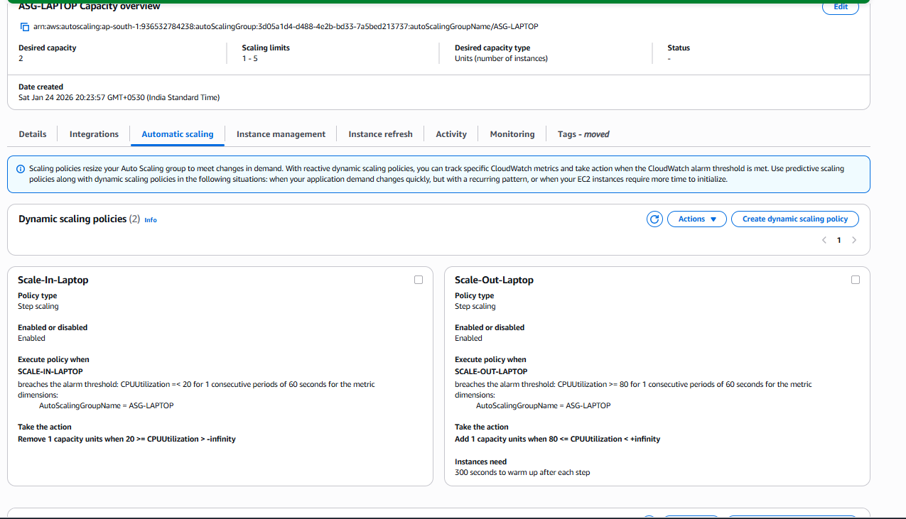
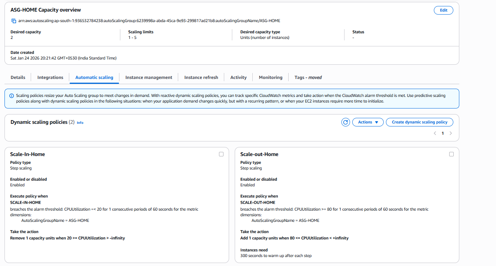
--------------------------------------------------
1.  TARGET GROUPS
--------------------------------------------------

tg-home
- HTTP 80
- Health check: /
- VPC = MS-VPC

tg-laptop
- Health check: /
- HTTP 80
- VPC = MS-VPC

tg-mobile
- Health check: /
- HTtP 80
- VPC = MS-VPC
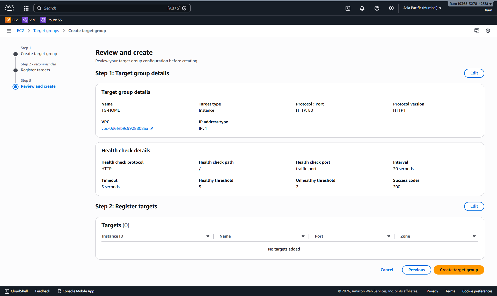
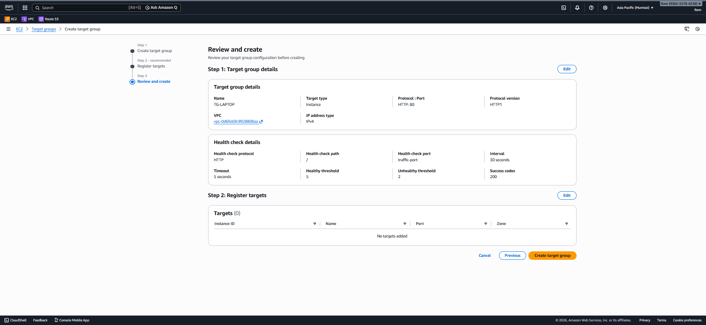

<b> TOTAL 3 TARGET GROUPS </b>
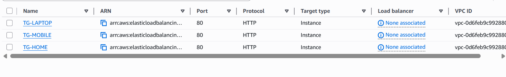
  


--------------------------------------------------
ATTACH TARGET GROUP TO ASG (asg-home → tg-home)
--------------------------------------------------

1. Auto-Scaling Group --> **asg-home**  --> **Integrations** --> Load Balancing
2. Click **Edit**  

3. Select **Attach to an existing target group**  
4. Choose **tg-home** from dropdown  

5. Click **Update**
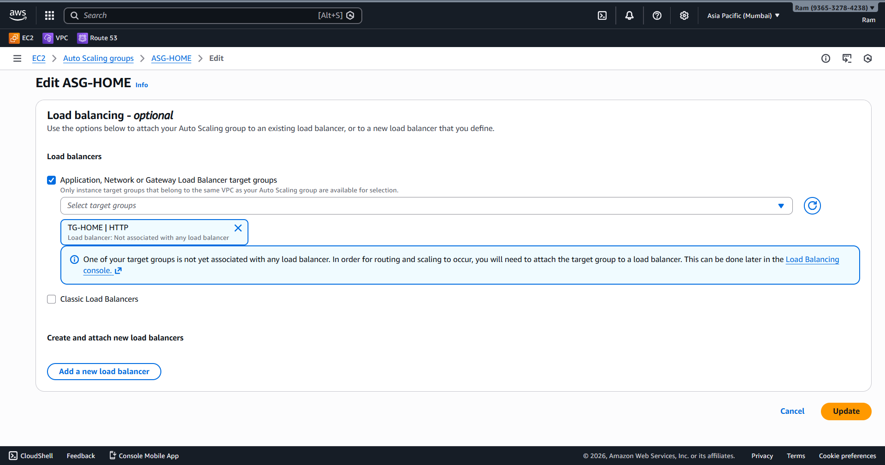

**Similarly With the Other Two ASG**
- asg-laptop → tg-laptop
- asg-mobile → tg-mobile
  
<b> Verify </b> 
- By going to Target-Group --> TG-Home --> Targets
- You should see at least one instance that is created by ASG-HOME


--------------------------------------------------
1.  APPLICATION LOAD BALANCER
--------------------------------------------------

Create ALB
- Name: ALB MS
- Internet-facing
- Subnets: all public SUBNETS 
  - if you haven't created at least two public subnet then it will not work
- SG: alb-sg
- Listener: HTTP 80
- Default TG: tg-home
  
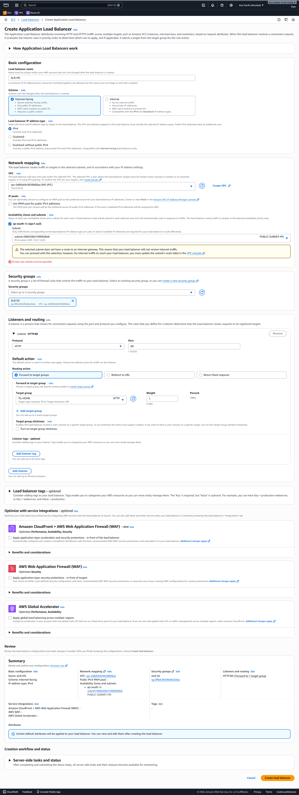

--------------------------------------------------
1.  LISTENER RULES
--------------------------------------------------

Rule 1
IF path = /laptop*
→ tg-laptop

Rule 2
IF path = /mobile*
→ tg-mobile

Default
→ tg-home


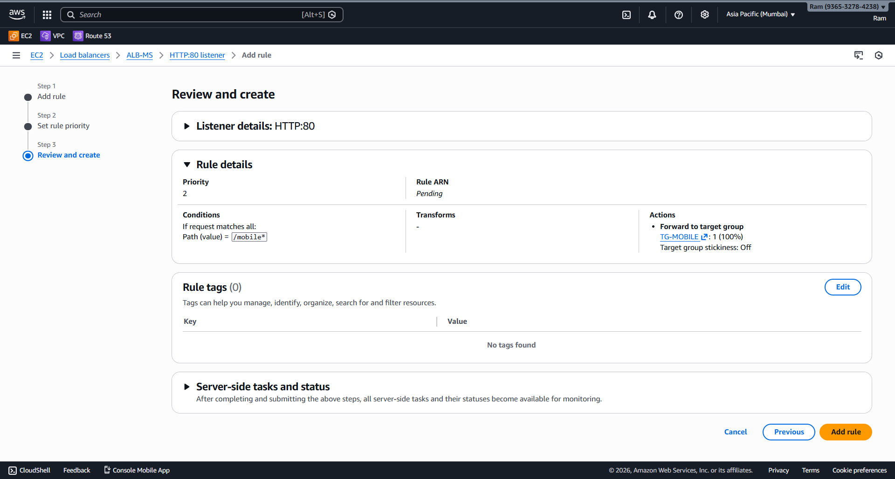

--------------------------------------------------
1.  VERIFICATION
--------------------------------------------------
ALB-DNS/
- /        → HOME ASG
  - 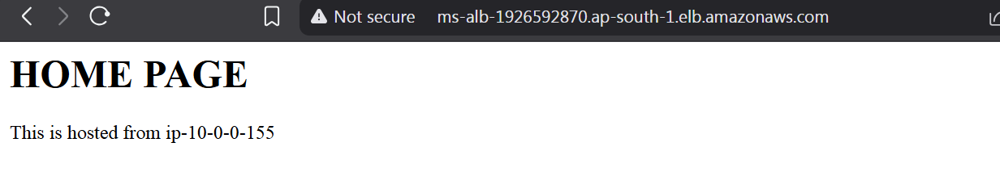
- /laptop → LAPTOP ASG
  - 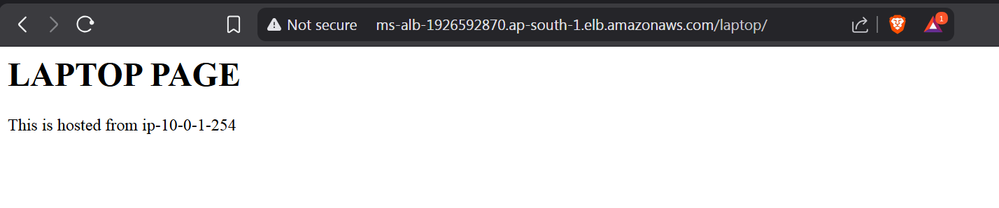
- /mobile → MOBILE ASG
  - 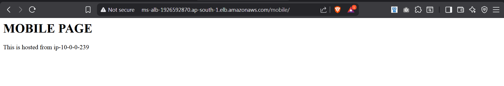

Increase load → CPU >80% → scale-out  
Remove load → CPU <20% → scale-in

--------------------------------------------------
FAQs
--------------------------------------------------
- If alb is not working then 
- 
