# Project Overview: EC2 Monitoring and Alerting Using AWS CloudWatch and SNS

### Objective

The goal of this project is to deploy an **Ubuntu-based Amazon EC2 instance** with secure, role-based access and implement **real-time system monitoring and alerting** for memory utilization. This ensures operational visibility and proactive notification when resource usage crosses a defined threshold.

---

### Scope of the Project

The project covers the following key areas:

* Secure EC2 access using **IAM Roles** (no hard-coded credentials)
* Deployment of **Ubuntu EC2 instances**
* Installation and configuration of the **Amazon CloudWatch Agent**
* Collection of **system-level metrics**, specifically memory utilization
* Automated alerting using **CloudWatch Alarms**
* Notification delivery through **Amazon SNS**

---

### Architecture Overview

1. **IAM Role for EC2**

   * An IAM role with administrative permissions is created and attached to the EC2 instance.
   * This enables the instance to interact securely with AWS services such as CloudWatch and SNS without using access keys.

2. **Ubuntu EC2 Instance**

   * An Ubuntu Server instance is launched with the IAM role attached.
   * Acts as the monitored compute resource.

3. **Amazon CloudWatch Agent**

   * Installed on the EC2 instance to collect system-level metrics not available by default (e.g., memory usage).
   * Sends metrics to Amazon CloudWatch under a custom namespace.

4. **Amazon CloudWatch**

   * Stores and visualizes EC2 metrics.
   * Evaluates memory utilization against defined thresholds.

5. **CloudWatch Alarm**

   * Triggers when memory usage exceeds **50%** on the EC2 instance.
   * Continuously monitors the metric over a defined evaluation period.

6. **Amazon SNS**

   * Delivers alert notifications via email (or other supported protocols) when the alarm state changes to **ALARM**.

---

### Key Features

* **Role-based security** using IAM (no credentials stored on the server)
* **Real-time monitoring** of memory utilization
* **Automated alerts** for proactive issue detection
* **Scalable and reusable design** for multiple EC2 instances
* **Cost-efficient monitoring** using native AWS services

---

### Benefits

* Early detection of performance issues
* Improved system reliability and uptime
* Reduced operational risk
* Simplified monitoring setup using managed AWS services
* Foundation for future enhancements such as auto-scaling or incident automation


## 1️⃣ Create an Admin IAM Role for EC2, Attach It, and Launch Ubuntu EC2

### A. Create IAM Role (Admin for EC2)

1. Open **AWS Console → IAM**
2. Click **Roles → Create role**
3. **Trusted entity**:

   * Select **AWS service**
   * Choose **EC2**
4. Click **Next**
5. **Permissions**:

   * Search and attach **AdministratorAccess**
   * (For production, you’d restrict this, but admin is fine for now)
6. Click **Next**
7. **Role name**:

   * Example: `EC2-Admin-Role`
8. Click **Create role**
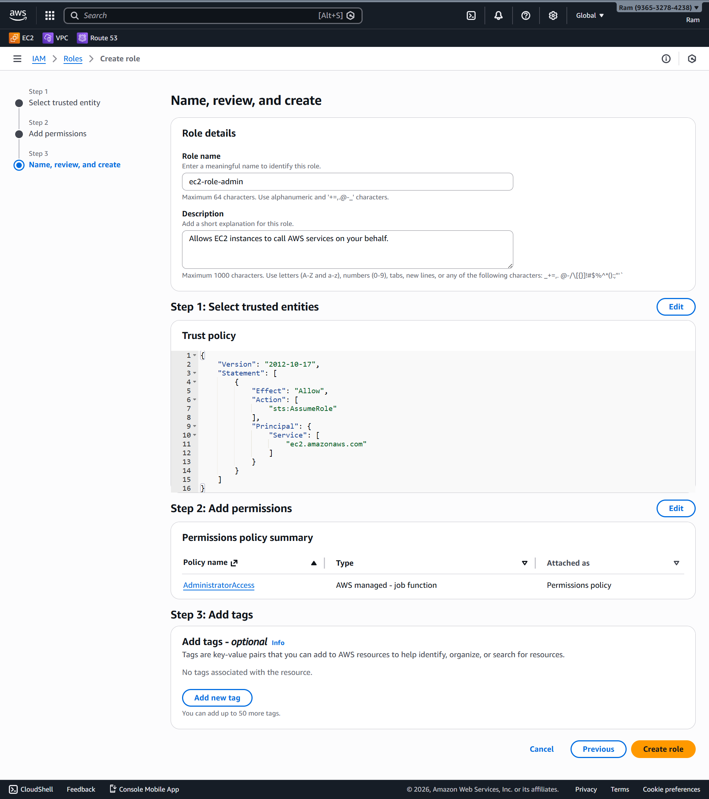
---

### B. Launch Ubuntu EC2 with the Role Attached

1. Go to **EC2 → Instances → Launch instance**
2. **Name**: `ubuntu-admin-ec2`
3. **AMI**:

   * Select **Ubuntu Server 22.04 LTS**
4. **Instance type**:

   * Choose something like `t3.micro` (or memory-optimized later)
5. **Key pair**:

   * Select existing or create new
6. **Network settings**:

   * Allow **SSH (22)** from your IP
7. **Advanced details** (important 👇):

   * **IAM instance profile** → select `EC2-Admin-Role`
   * 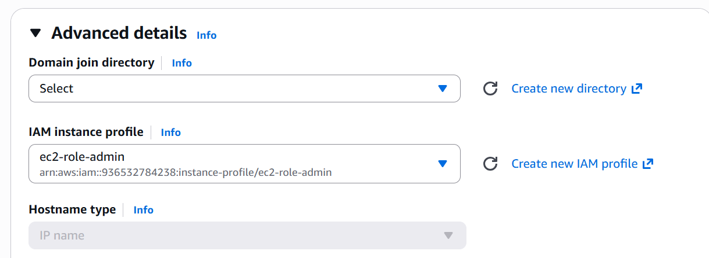
  
8. Click **Launch instance**
   
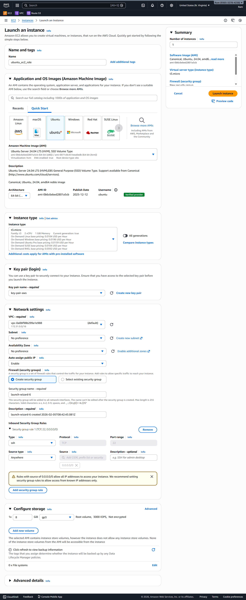

✅ EC2 now has admin permissions via IAM role (no access keys needed)

---

## 2️⃣ Configure CloudWatch Agent on Ubuntu EC2

### A. Insall Awscli for ubuntu 

First also need to install awscli if you are not on aws-linux

```bash
sudo snap install aws-cli --classic   
# Verify
aws s3 ls  
```

---

### B. Install CloudWatch Agent on Ubuntu

SSH into the EC2 instance:

```bash
sudo apt update \
curl -O https://s3.amazonaws.com/amazoncloudwatch-agent/ubuntu/amd64/latest/amazon-cloudwatch-agent.deb  \ 
sudo dpkg -i -E ./amazon-cloudwatch-agent.deb  

```

---

### C. Create CloudWatch Agent File

Run the config wizard:

### Create a /config directory where your json file is stored 

```bash
sudo mkdir /config
```
### Create a file in which all the configuration are written 
```bash
sudo vim /config/amazon-cloudwatch-agent.json
```
### Basic Configuration Metrics Only
```
{
  "metrics": {
    "namespace": "CWAgent",
    "metrics_collected": {
      "cpu": {
        "measurement": [
          "cpu_usage_idle",
          "cpu_usage_iowait",
          "cpu_usage_user",
          "cpu_usage_system"
        ],
        "totalcpu": false
      },
      "disk": {
        "measurement": [
          "used_percent"
        ],
        "resources": [
          "*"
        ]
      },
      "diskio": {
        "measurement": [
          "io_time"
        ],
        "resources": [
          "*"
        ]
      },
      "mem": {
        "measurement": [
          "mem_used_percent"
        ]
      },
      "netstat": {
        "measurement": [
          "tcp_established",
          "tcp_time_wait"
        ]
      },
      "processes": {
        "measurement": [
          "running",
          "sleeping",
          "dead"
        ]
      }
    }
  }
}

```
---

### D. Start CloudWatch Agent

```bash
# Start the agent with configuration
sudo /opt/aws/amazon-cloudwatch-agent/bin/amazon-cloudwatch-agent-ctl \
-a fetch-config \
-m ec2 \
-c file:/config/amazon-cloudwatch-agent.json \
-s
```

* Expected output:
* Successfully fetched the config and saved in /opt/aws/amazon-cloudwatch-agent/etc/amazon-cloudwatch-agent.json
* Start configuration validation...
* Configuration validation first phase succeeded
* Configuration validation second phase succeeded
* Configuration validation third phase succeeded
* Start the agent...
* Successfully started the CloudWatch agent


### E. Check agent status

```bash
sudo /opt/aws/amazon-cloudwatch-agent/bin/amazon-cloudwatch-agent-ctl -m ec2 -a status
```
* Expected output:
 {
   "status": "running",
   "starttime": "2024-01-15T10:30:00Z",
   "version": "1.300030.0"
 }

### logs check cmd 
```bash
cat /var/log/amazon/amazon-cloudwatch-agent/amazon-cloudwatch-agent.log
```
Metrics will appear in:
**CloudWatch → Metrics → CWAgent**
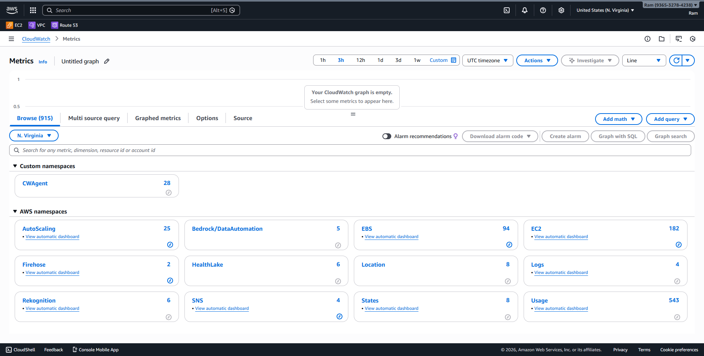
---

## 3️⃣ Create SNS Alert for Memory Utilization > 50%

### A. Create SNS Topic

1. Go to **SNS → Topics → Create topic**
2. Type: **Standard**
3. Name: `memory-alert-topic`
4. Click **Create topic**
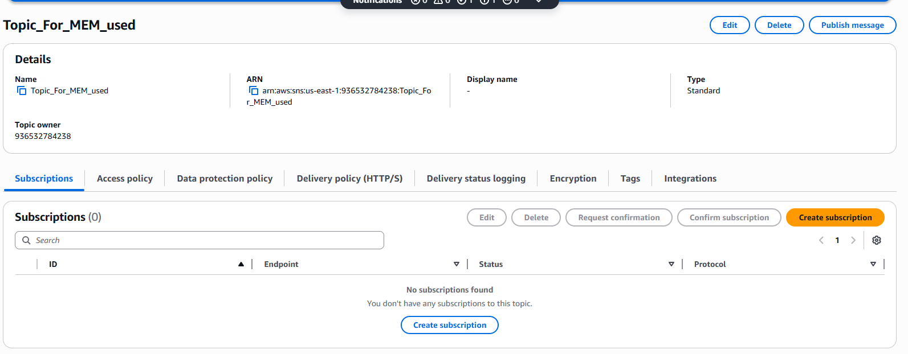
---

### B. Create SNS Subscription

1. Open the topic → **Create subscription**
2. Protocol:

   * `Email` (or SMS / Lambda)
3. Endpoint:

   * Your email address
4. Click **Create subscription**
5. **Confirm the email** from inbox
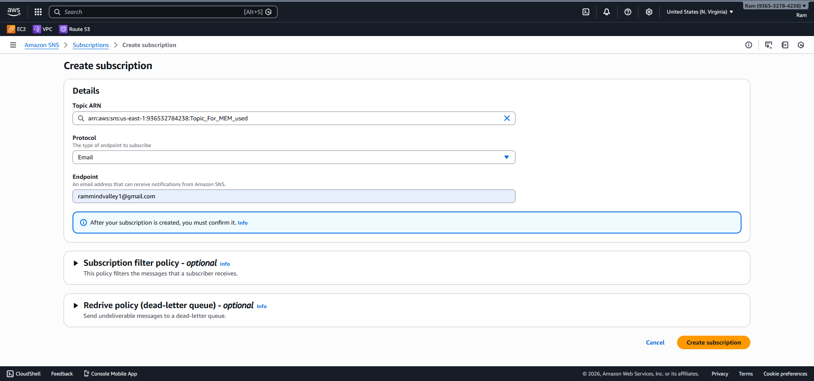
---

### C. Create CloudWatch Alarm (Memory > 35 %)

1. Go to **CloudWatch → Alarms → Create alarm**
2. **Select metric**
3. Navigate:

   ```
   CWAgent → host --> mem_used_percent
   ```

4. 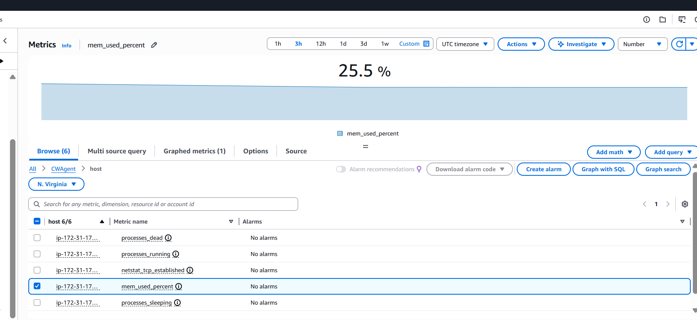
5.  **Select metric**
6.  Click **Create Alarm**

---

### D. Configure Alarm Conditions

* Statistic: **Average**
* Period: **1 minutes**
* Condition:

  * **Greater than**
  * **35**

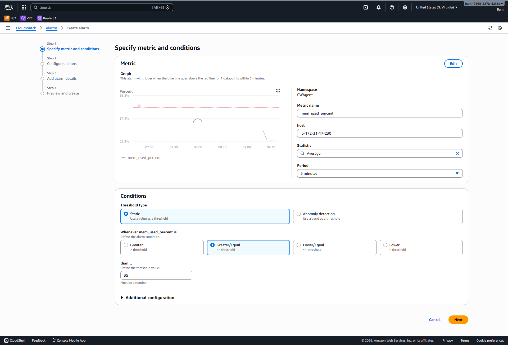
---

### E. Configure Actions

1. Alarm state: **In alarm**
2. Send notification to:

   * `memory-alert-topic`

---

### F. Finalize Alarm

* Alarm name: `EC2-Memory-Above-50`
* Click **Create alarm**
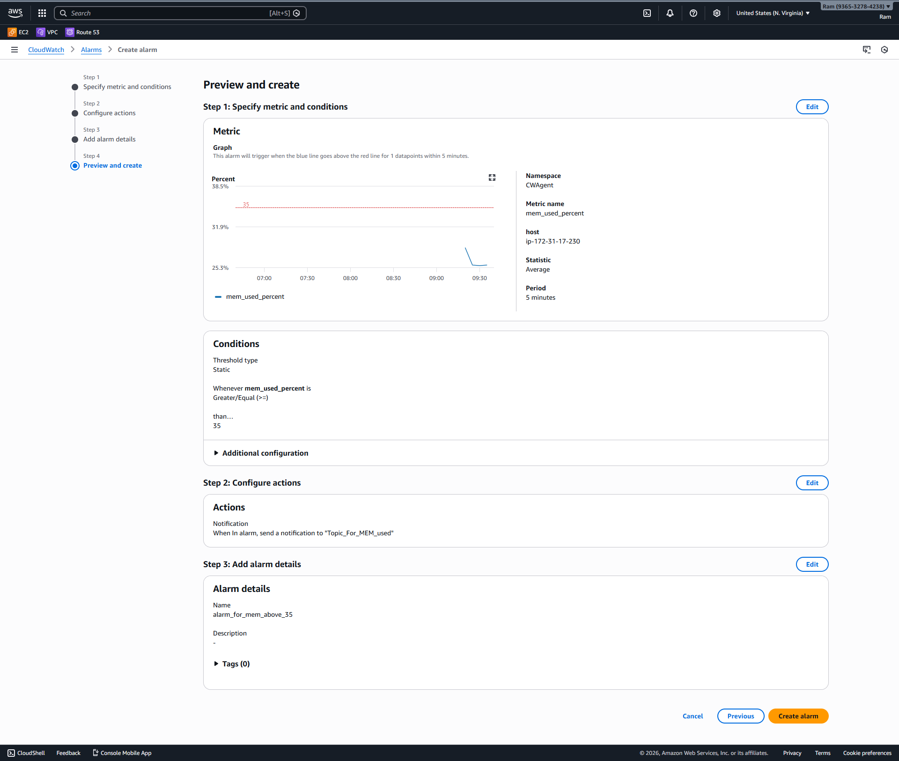

---
## ✅ Final Checklist

✔ EC2 has admin role
✔ CloudWatch Agent running
✔ Memory metrics visible
✔ SNS alerts configured
✔ Email notifications enabled
 
## Subscription Confirmation

* Go to Your email id and look for **AWS Subscription Confirmed** 
* Click **Confirm Subscription**
* 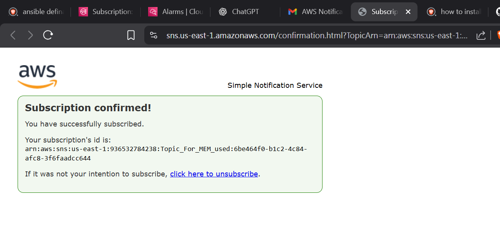


## Increasing Load and Memory Optimization for the Alarm to Trigger

* ssh into the instance 
* and type this cmd 
  ```bash
  sudo apt install -y stress-ng
  stress-ng --vm 1 --vm-bytes 80% --vm-keep --timeout 10m &
  ```

* CLick Enter and Wait for The alarm trigger

## Successful Message Trigger

* To trigger the alarm faster you can add more of the above cmds in instance terminal
* OR change the average time to 1 minute
* 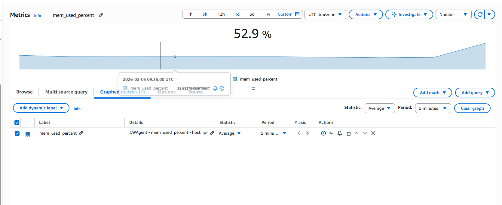
* and here is the mail 
* 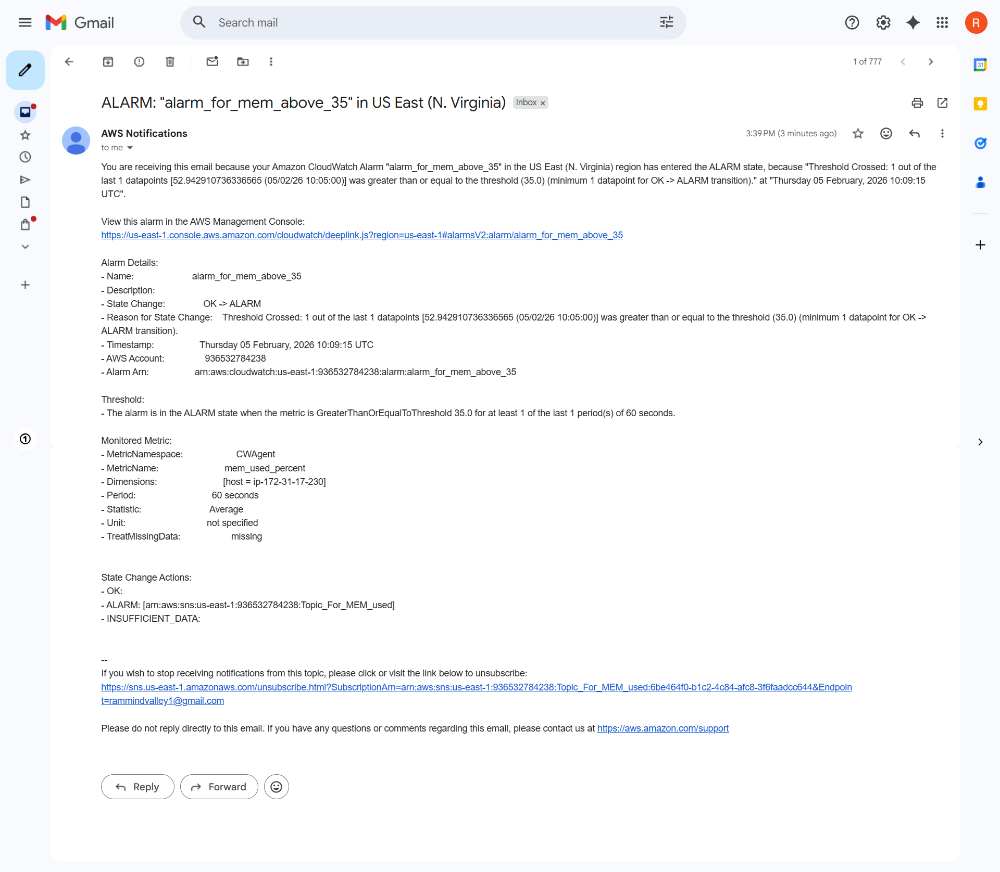
* And thus the pratical is performed 
* 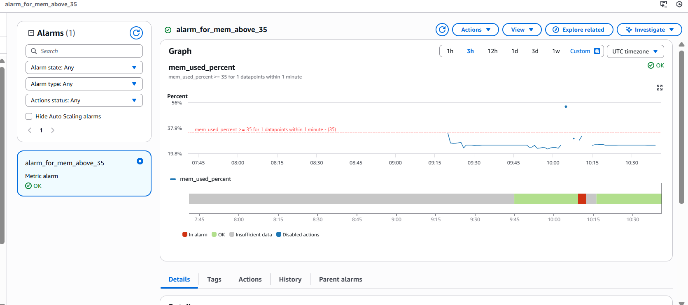


# Displaying EC2-logs into CloudWatch

## Objective 

We will Display the logs in the Cloudwatch location of the logs are at `/var/logs/nginx/access.log` 
and `/var/log/dmesg` 

* Fist install nginx on the server if not present
  ```bash
  sudo apt install nginx -y 
  ```
  Verify
  ```bash
  curl http://localhost
  ```
### Access both the logs file to see if they contain any logs or not 
  * Two logs file first
   1. /var/log/dmesg --> System logs for the ec2
   2. /var/log/nginx/access.log --> Nginx log for the Nginx Server
  * Change the permission to allow the cwagent user to access the log file 
   ```bash
  usermod -aG adm cwagent
  ```
### Edit the configuration file with 
```bash
sudo vim /config/amazon-clouwatch-agent.json
```
```json
{
  "agent": {
    "metrics_collection_interval": 60,
    "run_as_user": "cwagent"
  },
  "metrics": {
    "namespace": "CWAgent",
    "metrics_collected": {
      "cpu": {
        "measurement": [
          "cpu_usage_idle",
          "cpu_usage_iowait",
          "cpu_usage_user",
          "cpu_usage_system"
        ],
        "totalcpu": false
      },
      "disk": {
        "measurement": [
          "used_percent",
          "inodes_free"
        ],
        "resources": [
          "*"
        ]
      },
      "diskio": {
        "measurement": [
          "io_time"
        ],
        "resources": [
          "*"
        ]
      },
      "mem": {
        "measurement": [
          "mem_used_percent",
          "mem_available_percent"
        ]
      },
      "netstat": {
        "measurement": [
          "tcp_established",
          "tcp_time_wait"
        ]
      },
      "processes": {
        "measurement": [
          "running",
          "sleeping",
          "dead"
        ]
      }
    }
  },
  "logs": {
    "logs_collected": {
      "files": {
        "collect_list": [
          {
            "file_path": "/var/log/nginx/access.log",
            "log_group_name": "nginx",
            "log_stream_name": "{instance_id}",
            "timezone": "UTC"
          },
          {
            "file_path": "/var/log/dmesg",
            "log_group_name": "ec2/secure",
            "log_stream_name": "{instance_id}",
            "timezone": "UTC"
          }
        ]
      }
    }
  }
}
```

* ReConfigure Your CloudWatch Agent with this CMDs

### Start the agent with configuration
```bash
sudo /opt/aws/amazon-cloudwatch-agent/bin/amazon-cloudwatch-agent-ctl \
-a append-config \
-m ec2 \
-c file:/config/amazon-cloudwatch-agent.json \
-s

```

### Expected output in CLoudwatch --> Logs --> Log Managements

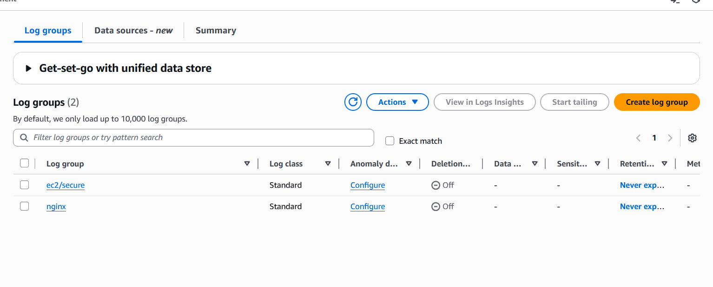

* Go inside the nginx to see access logs of nginx server
* Go to ec2/secure to see the logs for ec2 instance

## examples

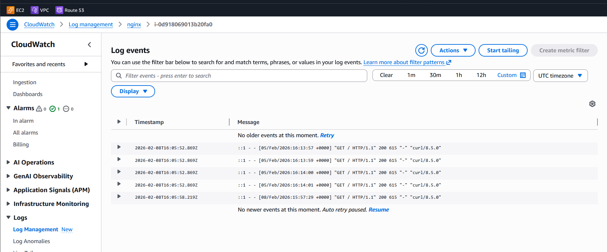

#### Check Agent Status

```bash
sudo /opt/aws/amazon-cloudwatch-agent/bin/amazon-cloudwatch-agent-ctl -m ec2 -a status
```

#### View Agent Logs

```bash
# Agent logs location
sudo tail -f /opt/aws/amazon-cloudwatch-agent/logs/amazon-cloudwatch-agent.log
```

### 4.5 Troubleshooting

#### Agent Not Starting

**Check IAM permissions:**
```bash
# Test IAM role permissions
aws cloudwatch put-metric-data \
  --namespace TestNamespace \
  --metric-name TestMetric \
  --value 1 \
  --region us-east-1
```

**Check agent logs:**
```bash
sudo cat /opt/aws/amazon-cloudwatch-agent/logs/amazon-cloudwatch-agent.log
```

**Verify configuration:**
```bash
# Validate configuration
sudo /opt/aws/amazon-cloudwatch-agent/bin/amazon-cloudwatch-agent-ctl \
  -a fetch-config \
  -m ec2 \
  -c file:/config/amazon-cloudwatch-agent.json \
  -s
```

#### Metrics Not Appearing in CloudWatch

**Wait for metrics:**
- Metrics appear within 1-2 minutes after agent starts
- Check namespace: `CWAgent` (or your custom namespace)

**Verify agent is running:**
```bash
sudo /opt/aws/amazon-cloudwatch-agent/bin/amazon-cloudwatch-agent-ctl -m ec2 -a status
```

**Check network connectivity:**
```bash
# Test CloudWatch endpoint
curl -I https://monitoring.us-east-1.amazonaws.com
```

#### Logs Not Appearing

**Check log file permissions:**
```bash
# Ensure agent can read log files
sudo ls -la /var/log/myapp/application.log
```

**Note – Fixing permissions for `/var/log/nginx/access.log`:**

The CloudWatch agent runs as the `cwagent` user. If collecting nginx access logs, the agent may not have read access. Add `cwagent` to the `adm` group so it can read system logs (including nginx logs that are typically readable by adm):

```bash
usermod -aG adm cwagent
```

Then restart the CloudWatch agent for the change to take effect.

**Check log group exists:**
```bash
# List log groups
aws logs describe-log-groups --region us-east-1
```

**Verify log file path:**
```bash
# Ensure file path in config matches actual file
ls -la /var/log/myapp/application.log
```


