# AWS Network Load Balancer (NLB) with Custom Health Checks

Author: Me  

## Architecture Overview

I implemented an AWS Network Load Balancer (NLB) with customized health checks and tuned target group attributes to ensure low latency, high availability, and predictable failover.

# First Create an Instances

- create 3 instances with the sam econfiguration and using a user-data-script 
- user-data-script 
  
#!/bin/bash
apt update -y
apt install nginx -y 
echo "<h1> NLB Practicals </h1> 
 This is launched from </u>$(hostname)</u> 
" > /var/www/html/inex.html
echo "This is health check" > /var/www/html/hc.txt
systemctl enable nginx
systemctl restart nginx

    
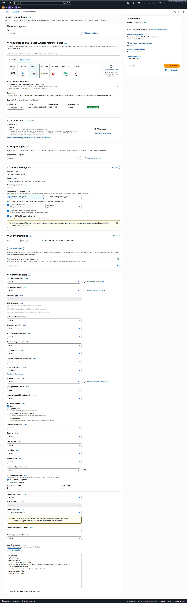

## Step 2: Target Group Creation

- Target type: Instance
- Protocol: TCP
- Port: 80
- VPC: Default
- We are creating a Halth Check for The Target Group here itself so here are the steps of it
- Settings for the Health Check
    - Protocol: TCP / HTTP
    - Path: /health (HTTP)
    - Interval: 30s
    - Timeout: 10s
    - Healthy threshold: 3
    - Unhealthy threshold: 3
Each service has its own target group for independent health management.

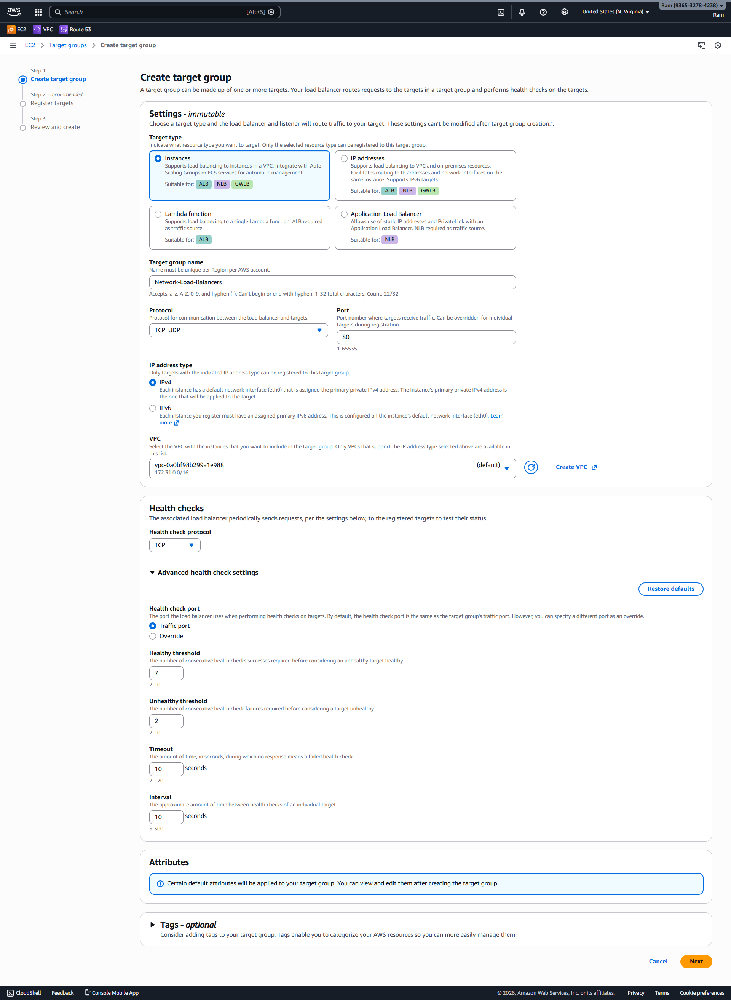

## Step 3: Registering Targets

EC2 instances were registered and monitored continuously via health checks.

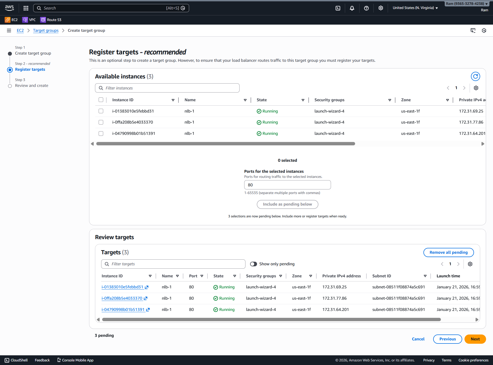
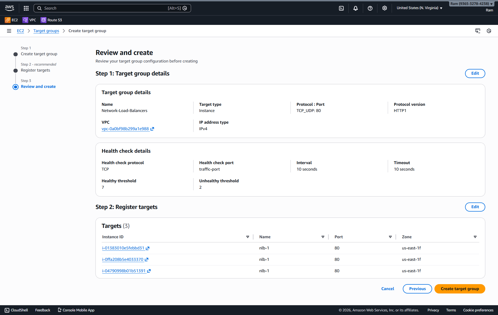

## Step 1: Creating the Network Load Balancer

I created a Network Load Balancer with:
- Type: Network
- Scheme: Internet-facing
- IP type: IPv4
- VPC: Default VPC
- AZs: All enabled

Why NLB:
- Layer 4 (TCP)
- Preserves client IP
- Static IPs per AZ
- Extremely high throughput

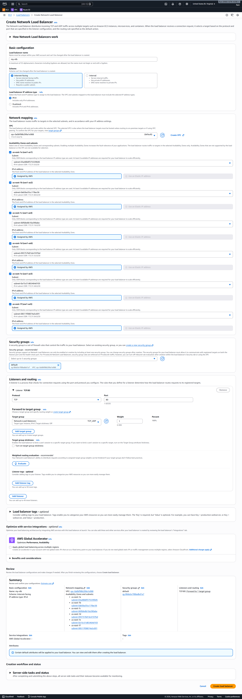

## Step 4: Check if everything is working fine 

- Copy th DNS name of the nlb provided after the status of netowrk load balancer is turned active
- hit the address in the browser and keep pressing Refresh 
  
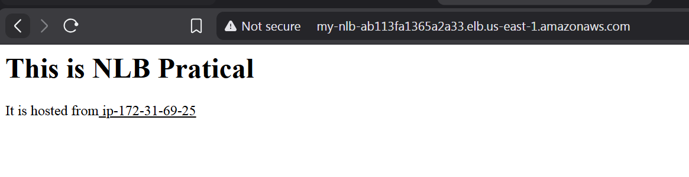
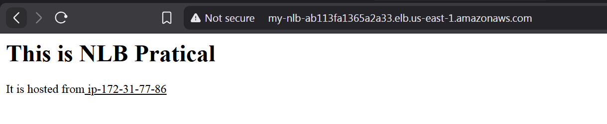
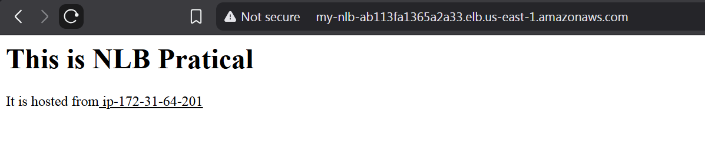
- You can see three different ips loading 

## Step 5: Target Group Attributes

I modified the following:
- Deregistration delay (reduced)
- Preserve client IP (enabled)
- Proxy protocol v2 (enabled when required)

This prevents dropped connections during deployments.

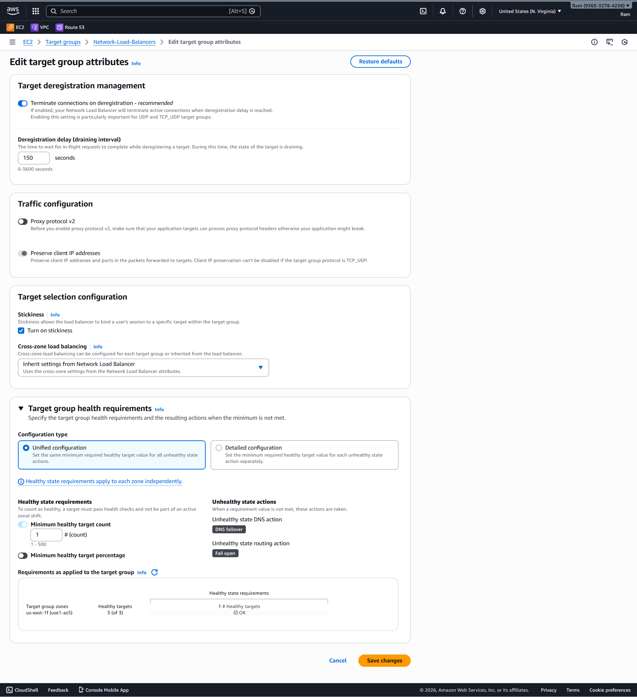

## Step 6: Verify by Forcefully stopping one instance

I did ssh to one of the instanes and forcefully stopped the nginx

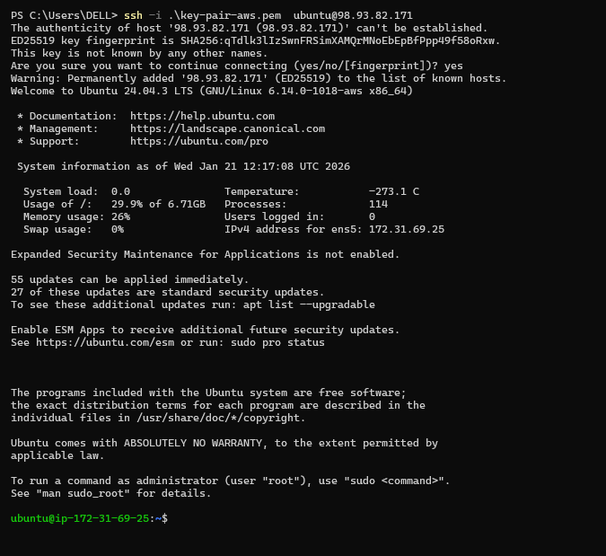
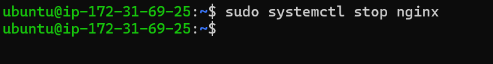

## What Happens After the nginx stopped one one server
- The instances is declared Unhealthy
- and now the Load Balncer is not routing the traffic to it 
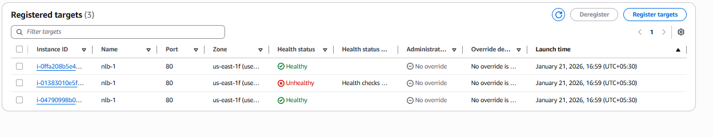

Unhealthy instances are immediately removed, traffic shifts automatically, and recovered instances rejoin without manual action.

## Final Outcome

A production-ready, low-latency, fault-tolerant NLB configuration.
Unhealthy instances are immediately removed, traffic shifts automatically, and recovered instances rejoin without manual action.