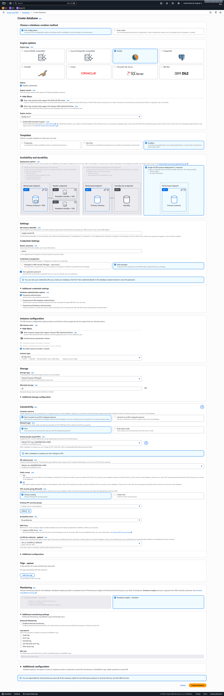
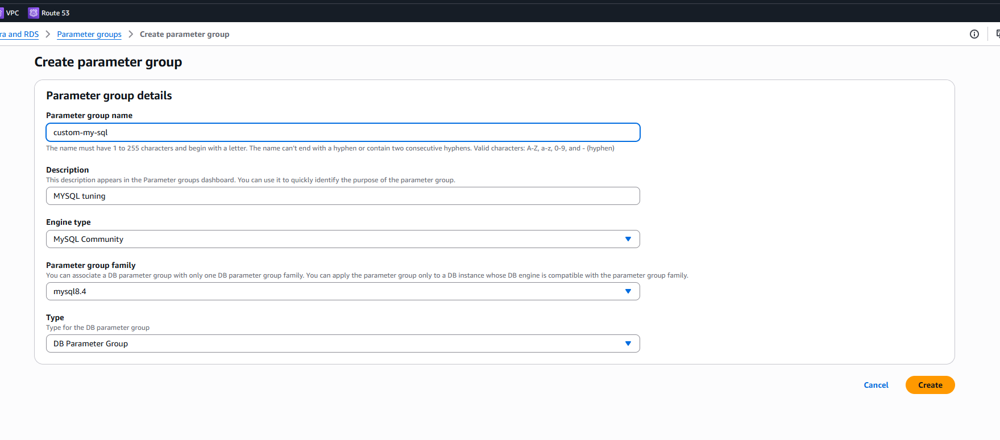
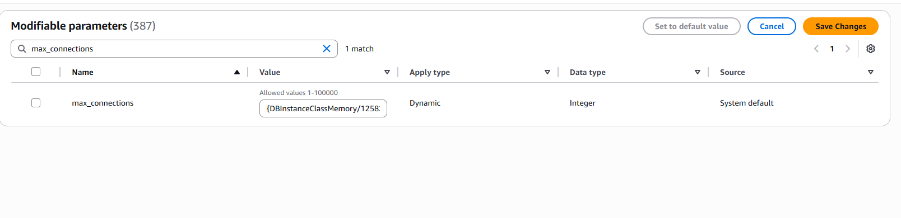
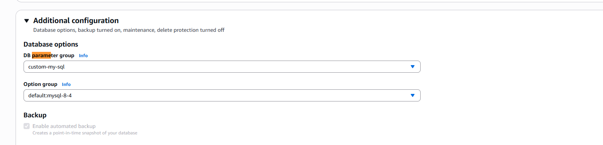
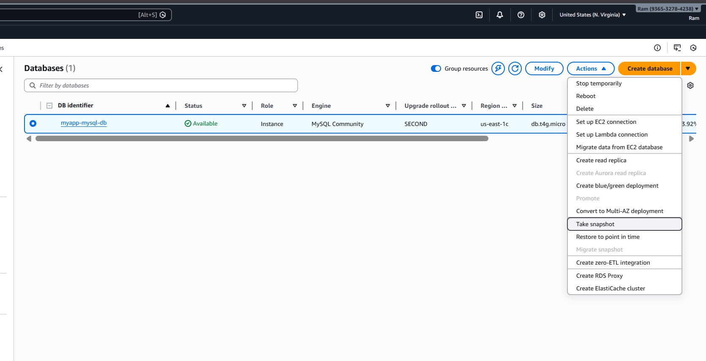
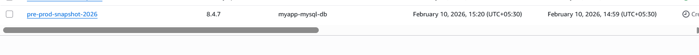

Got it — I’ll walk you through this **end-to-end**, like you’re actually setting it up in AWS. I’ll assume **Amazon RDS MySQL** (most common). I’ll call out **Postgres differences** where it matters.

---

## 1. Create the RDS DB (full configuration)

### Option A: AWS Console (clear + safe)

**AWS Console → RDS → Databases → Create database**

### 1️⃣ Engine

* **Engine**: MySQL
* **Version**: Choose a stable one (ex: `8.0.x`)
* **Templates**:

  * Sandbox → cheaper
  * Production → enables Multi-AZ, backups, etc.

---

### 2️⃣ Settings

* **DB instance identifier**:
  `myapp-mysql-db`
* **Master username**:
  `root`
* **Master password**:
  Strong password (save this)
  * Auto generate aws password
  * Copy the pasword which will be shown `view Credential Details` in the dialogue box at the top after successfully creating the sql


> ⚠️ You **cannot change** the master username later.

---

### 3️⃣ Instance configuration

* **DB instance class**:
  `db.t3.micro` (dev) or higher for prod
* **Storage type**: General Purpose (gp3)
* **Allocated storage**: 20–100 GB
* **Enable storage autoscaling**: ✔ recommended

---

### 4️⃣ Connectivity

* **VPC**: your application VPC
* **Subnet group**: private subnets preferred
* **Public access**:

  * ❌ No (recommended)
  * ✔ Yes (only for testing)
* **VPC security group**:

  * Allow inbound MySQL **3306** from:

    * Your app servers
    * Your local IP (for remote access)

Example inbound rule:

```
MySQL/Aurora | TCP | 3306 | 203.xxx.xxx.xxx/32
```

---

### 5️⃣ Database authentication

* Password authentication ✔
* IAM auth → optional

---

### 6️⃣ Additional configuration

* **Initial database name**:
  `appdb`
* **DB parameter group**:
  Create custom (important — see next section)
* **Backup retention**:

  * Dev: 7 days
  * Prod: 7–35 days
* **Backup window**: set preferred time
* **Enable automated backups** ✔
* **Enable deletion protection** ✔ (prod)

👉 Click **Create database**


---

## 2.  Master Hostname (Optional for Bigger Setups)

RDS **does not allow setting a hostname directly**.

### ✅ Correct way: Route 53 CNAME

Once the DB is created, AWS gives you:

```
myapp-mysql-db.abc123xyz.us-east-1.rds.amazonaws.com
```

### Create custom hostname

**Route 53 → Hosted Zone → Create record**

* **Record type**: CNAME
* **Name**:
  `db.mycompany.com`
* **Value**:

```
myapp-mysql-db.abc123xyz.us-east-1.rds.amazonaws.com
```

Now your **custom master hostname** is:

```
db.mycompany.com
```

Otherwise you can always use the original endpoints for RDS

```bash
myapp-mysql-db.ckjgcmius5j3.us-east-1.rds
```
* ✔ Survives instance failovers
* ✔ Works for apps
* ✔ AWS best practice

---

## 3. Create & Modify Parameter Group

### Create custom parameter group

**RDS → Parameter groups → Create**

* **Family**: `mysql8.4`
* **Name**: `MySql_community`
* **Description**: MySQL tuning



---

### Common parameters to modify

| Parameter              | Value              | Why      |
| ---------------------- | ------------------ | -------- |
| `max_connections`      | 300+               | App load |
| `slow_query_log`       | 1                  | Debug    |
| `long_query_time`      | 2                  | Perf     |
| `log_output`           | FILE               | Logs     |
| `character_set_server` | utf8mb4            | Unicode  |
| `collation_server`     | utf8mb4_unicode_ci | Unicode  |

👉 Save changes


---

### Apply parameter group

**RDS → Databases → Modify**

* Change **DB parameter group** → `custom-mysql8`
* Apply:

  * Immediately (or)
  * During maintenance window

> ⚠️ Some parameters require **reboot**



---

## 4. Take Backup (Manual + Automated)

### Automated backup (already enabled)

* Happens daily
* Used for point-in-time recovery

---

### Manual snapshot

**RDS → Databases → Actions → Take snapshot**

* Name: `pre-prod-snapshot-2026`

* ✔ Stored until you delete it
* ✔ Can restore anytime





---

## 5. Connect to RDS (Endpoints)

### Find endpoints

**RDS → Databases → Connectivity & security**

You’ll see:

* **Writer endpoint**:

```
db.mycompany.com   (via CNAME)
```

* **Reader endpoint** (if read replicas enabled)

---

## Test connection (ec2 instance)

* Create  an ec2 instance in default VPC and an ubuntu ami
* Allow MySQL/Aurora 3306 posrt no on the Security Group

```bash
mysql -h myapp-mysql-db.ckjgcmius5j3.us-east-1.rds -P 3306 -u root -p
```


If this fails:

* Check security group
* Check public accessibility
* Check local IP allowlist

---

## 6. Create Two Users (Remote + Local)

### Connect as master

```bash
mysql -h b.mycompany.com -u root -p
USE appdb;d
```

---

### User 1: Remote access user

```sql
CREATE USER 'remote_user'@'%' IDENTIFIED BY 'StrongPass123!';
GRANT ALL PRIVILEGES ON appdb.* TO 'remote_user'@'%';
```

✔ `%` = can connect from anywhere (controlled by SG)

---

### User 2: Local/VPC-only user

```sql
CREATE USER 'local_user'@'10.%' IDENTIFIED BY 'LocalPass123!';
GRANT ALL PRIVILEGES ON appdb.* TO 'local_user'@'10.%';
```

This allows:

* Only from **VPC IP range**
* Good for app servers

---

### Apply privileges

```sql
FLUSH PRIVILEGES;
```

---

## 7. Test Both Users

### Remote user

```bash
mysql -h db.mycompany.com -u remote_user -p appdb
```

### Local user (from EC2 inside VPC)

```bash
mysql -h  -u local_user -p appdb
```

---

## 8. Security Best Practices (Don’t Skip)

* ❌ Never use master user in apps
* ✔ Rotate passwords
* ✔ Use Secrets Manager
* ✔ Enable SSL:

```bash
mysql --ssl-ca=rds-combined-ca-bundle.pem
```

* ✔ Restrict SG rules tightly

---

## Postgres Differences (Quick)

* Port: **5432**
* Users use:

```sql
CREATE ROLE user LOGIN PASSWORD 'pass';
```

* Parameter groups differ (`shared_buffers`, etc.)

---

If you want, I can:

* Give **AWS CLI / Terraform** version
* Show **IAM auth setup**
* Help with **Multi-AZ + read replicas**
* Lock this down for **production-grade security**

Just say the word 👌
