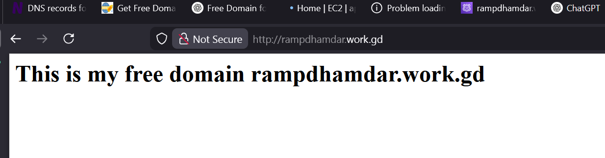
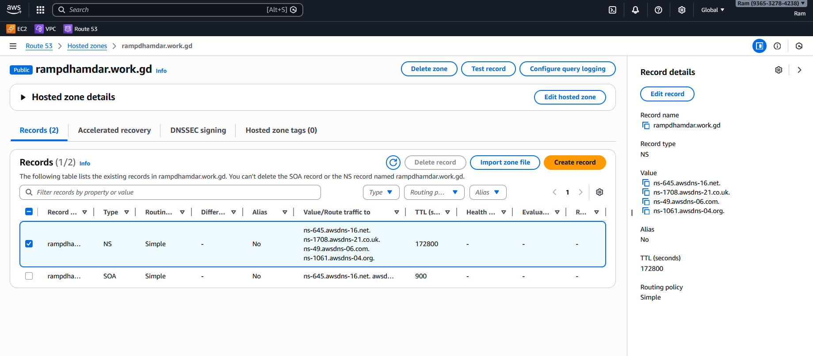
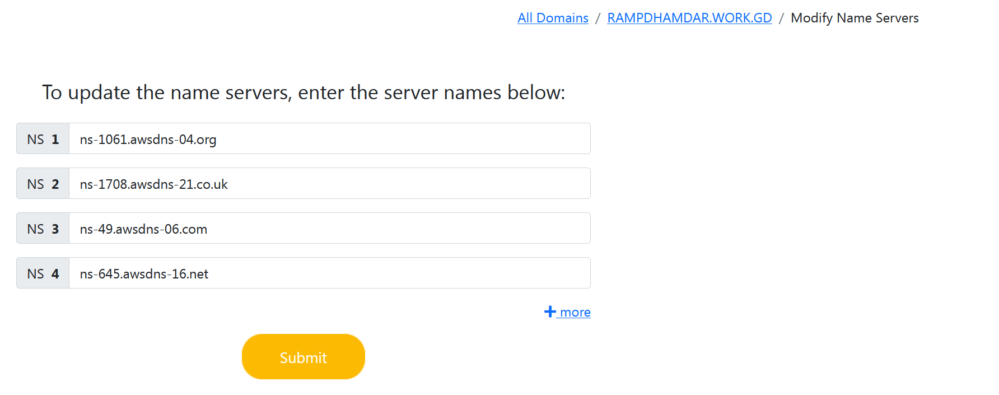
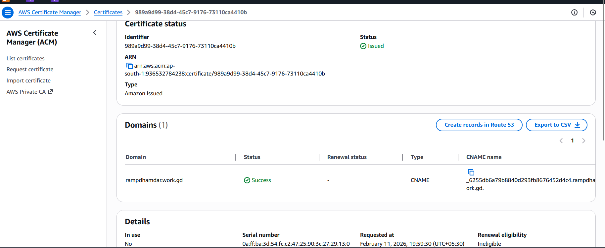
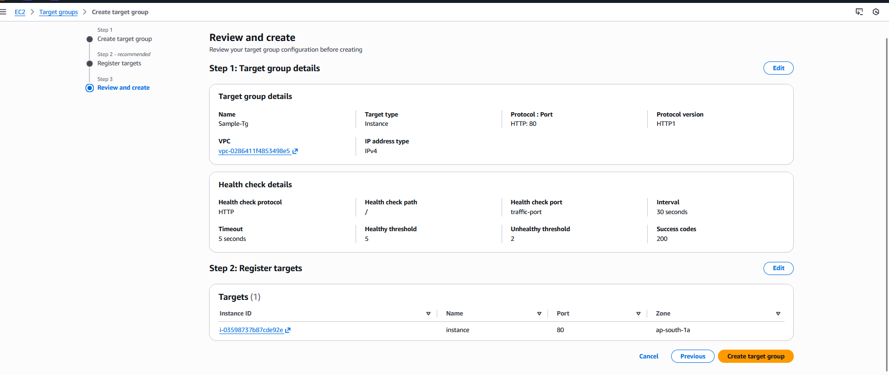
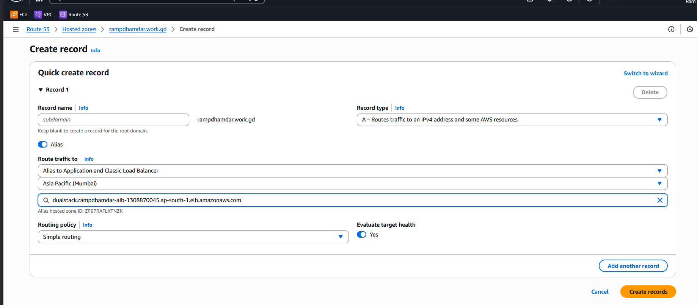
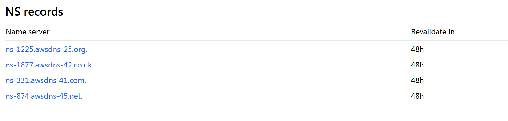

## Goal

* Create Hosted Zone in Route 53 for: **rampdhamdar.work.gd**
* Point it to an Application-Load-Balancer `rampdhamdar-alb` 
* Verify using `nslookup` 
* Attach SSL using ACM (correct way)

---

# ⚠️ Important Reality First

You **cannot directly attach ACM SSL to an EC2 instance via Route 53**.

ACM certificates can be attached only to:

* Application Load Balancer (ALB)
* Network Load Balancer (with TLS)
* CloudFront
* API Gateway

So if you want SSL → you need **ALB in front of EC2**
(OR install SSL manually on the instance with Nginx + Certbot)

Below is the correct AWS production way.

---

# PART 1 — Create Hosted Zone in Route 53

### Step 1 → Open Route 53

AWS Console → Search **Route 53** → Click

### Step 2 → Create Hosted Zone

1. Click **Hosted Zones**
2. Click **Create hosted zone**
3. Domain name:

   ```
   rampdhamdar.work.gd
   ```
4. Type → **Public Hosted Zone**
5. Click **Create**


You’ll now see:

* 1 NS record
  * That contains 4 nameserver 
* 1 SOA record

---

# PART 2 — Update Nameservers at Domain Provider (Freedomain.one)

Route 53 gives you 4 NS values like and but not exactly this:

```
ns-123.awsdns-45.com
ns-456.awsdns-11.net
ns-789.awsdns-22.org
ns-111.awsdns-33.co.uk
```

### Go to https://freedomain.one --> Login --> All Domains--> `rampdhamdar.work.gd`--> Modify Name Servers </br>



Replace existing nameservers with these 4 from Route 53.


### Wait 5–30 minutes (sometimes up to 24 hrs).

---
# PART 3 — SSL using ACM 


### STEP A — Request ACM Certificate

1. Go to **AWS Certificate Manager**

2. Click **Request certificate**

3. Select:
   → Request public certificate

4. Domain name:

   ```
   rampdhamdar.work.gd
   ```

5. Validation method:
   → **DNS validation**

6. Request

---

### STEP -B Validate Certificate via Route 53

After request:

ACM will give **CNAME record**

Click:
👉 **Create records in Route 53**

(It auto-creates validation record)

Wait until certificate status becomes:

```
ISSUED
```



---
# PART -3 Create an AlB 

### 1. - Lauch an Instance in Default VPC 
 * Seurity Group Allow SSH,HTTP and HTTPS 
 * ami = ubuntu ami 
### 2. - Set up nginx server in the instance
 * SSH into your ec2 using private key and public ip
 * run these commands 
    ```bash
    sudo apt update
    sudo apt install nginx -y
    sudo -i
    echo "<h1> This website should be hosted on rampdhamdar.work.gd </h1>" > /var/www/html/index.html
    curl localhost
    ```
 * `<h1> This website should be hosted on rampdhamdar.work.gd </h1>` should be seen in the output 
 * Ensure the Security Group allows HTTp ,HTTPS, SSH from anywhere

### 3- Create Target Group 
 * We will create only one instance target group for this practical 
 * You can attach aSG + multiple target group if you want
   * Name - Sample-TG
   * Rest all as Defaults
   * Include the Instance as Pending below
   * Create Target Group 
  



### 4- Create ALB
 * Name - `rampdhamdar-alb`
 * Internet Facing
 * Forward to target group --> `Sample-tg`
 * Add listner
   * https --> 443
   * forward to target group --> `Sample-tg`
   * security --> From ACM --> Select ssl certificate
 * Create Load Balancer
 * Modify Security Group of the ALB to allow http https from anywhere ipv4
 * 
  


---

# PART  — Create A Record pointing to ALB 

### Step 1 → Open Hosted Zone

Click **rampdhamdar.work.gd**

### Step 2 → Create Record

Click **Create record**

* Record name: (leave empty for root domain)
* Record type: **A**
* Alias : On
* Choose Endpoint --> Application and Classic LoadBalancer
* Choose Region--> Ap-south-1
* Selct --> rampdhamdar-alb
* Routing policy: Simple
* TTL: 300
  
Click **Create records**




---

# PART 4 — nslookup Check

After DNS propagation:

Go To https://www.nslookup.io and search for `rampdhamdar@work.gd` and CLick Find DNS Records

  * You should see aws name server in the NAME Servers Section
    
  * 

### Or you can check using CMDLINE on the following OS:
### On Windows:

```bash
nslookup rampdhamdar.work.gd
```

Expected output:

```
Name: rampdhamdar.work.gd
Address: 13.234.56.78
```

OR check using Google DNS:

```bash
nslookup rampdhamdar.work.gd 8.8.8.8
```

If IP matches EC2 public IP → DNS working.

---


# Final Architecture (Correct)

```
User
  ↓
Route 53
  ↓
Application Load Balancer (HTTPS + ACM)
  ↓
EC2 Instance
```

Now your site works with:

```
https://rampdhamdar.work.gd
```

---

# Final Verification

### Test DNS

```bash
nslookup rampdhamdar.work.gd
```

Should resolve to ALB DNS.

---

### Test HTTPS

Open:

```
https://rampdhamdar.work.gd
```

You should see:


🔒 Secure connection
Certificate issued by Amazon


