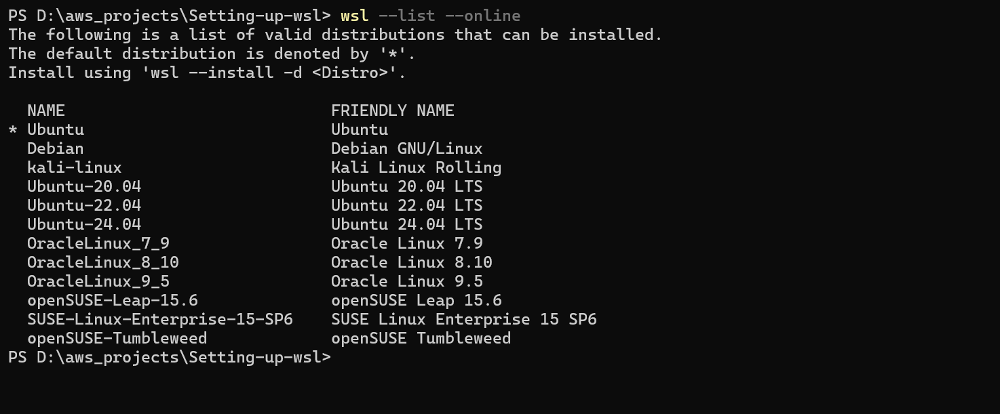

## 1️⃣ Install WSL + Ubuntu 24.04 from PowerShell

Open **PowerShell as Administrator**

### Check available distros

```powershell
wsl --list --online
```

### Install Ubuntu 24.04

```powershell
wsl --install -d Ubuntu-24.04
```

### Restart PC when prompted

After reboot, Ubuntu will open and ask for:

```
username
password
```

---

# 2️⃣ Update Ubuntu

Inside the Ubuntu terminal:

```bash
sudo apt update && sudo apt upgrade -y
```

---

# 3️⃣ Install ZSH

```bash
sudo apt install zsh git curl -y
```

Check version:

```bash
zsh --version
```

Set zsh as default shell:

```bash
chsh -s $(which zsh)
```

Restart terminal.

---

# 4️⃣ Install Oh My Zsh

```bash
sh -c "$(curl -fsSL https://raw.githubusercontent.com/ohmyzsh/ohmyzsh/master/tools/install.sh)"
```

---

# 5️⃣ Install the **Fox Theme**

Clone theme:

```bash
git clone https://github.com/ohmyzsh/ohmyzsh.git ~/.oh-my-zsh
```

Edit config:

```bash
nano ~/.zshrc
```

Find:

```
ZSH_THEME="robbyrussell"
```

Replace with:

```
ZSH_THEME="fox"
```

Save:

```
CTRL + X
Y
ENTER
```

Reload:

```bash
source ~/.zshrc
```

---

# 6️⃣ Install ZSH Syntax Highlighting

```bash
git clone https://github.com/zsh-users/zsh-syntax-highlighting.git \
${ZSH_CUSTOM:-~/.oh-my-zsh/custom}/plugins/zsh-syntax-highlighting
```

---

# 7️⃣ Install ZSH Autosuggestions

```bash
git clone https://github.com/zsh-users/zsh-autosuggestions \
${ZSH_CUSTOM:-~/.oh-my-zsh/custom}/plugins/zsh-autosuggestions
```

---

# 8️⃣ Enable Plugins

Open config:

```bash
nano ~/.zshrc
```

Find:

```
plugins=(git)
```

Change to:

```
plugins=(git zsh-autosuggestions zsh-syntax-highlighting)
```

Save and reload:

```bash
source ~/.zshrc
```

---

# 9️⃣ Final Result

Your terminal now has:

✔ **Oh My Zsh**
✔ **Fox theme**
✔ **Command autosuggestions**
✔ **Syntax highlighting**
✔ **Ubuntu 24.04 running inside WSL**

---

# 🔥 Optional (Highly Recommended)

Install **powerline fonts** so themes display correctly:

```bash
sudo apt install fonts-powerline -y
```

---

💡 If you want, I can also show you **how to make your WSL terminal look like a professional DevOps setup (10× better)** with:

* **Starship prompt**
* **Nerd Fonts**
* **Modern terminal UI**
* **Better git integration**.
