# Overview

### Today we will  be creating a sample Traffic Policy praticals to route different customer based on their Loaation to different ec2 Instance

* Root: Route 53
* Level 1: **Weighted routing** → Singapore region & Mumbai region
* Singapore: **Failover routing** (2 EC2 instances + health check)
* Mumbai: **Geolocation routing** (India users → 1 EC2, US users → 1 EC2)

I’ll break this into:

1. Where all instances are created
2. AWS Console step-by-step setup
3. Performance analysis

---

# 1️⃣ Where All Instances Are Created

### ✅ Singapore Region (ap-southeast-1)

* EC2 Instance 1 → Primary
* EC2 Instance 2 → Secondary (failover)
* 1 Health Check (attached to primary)

### ✅ Mumbai Region (ap-south-1)

* EC2 Instance 3 → India users
* EC2 Instance 4 → US users

Total Instances = **4 EC2 Instances**

---

# 2️⃣ AWS Console Steps (Exact Order)

---

# STEP 1 — Create EC2 Template 

## 🔹 A. Singapore Region (ap-southeast-1)

1. Switch region → Singapore
2. EC2 → Launch Instance
3. Create:

   * sg-primary
   * sg-secondary
4. Same AMI (Ubuntu ami)
5. Enable:

   * HTTP (80)
   * SSH (22)
6. Install simple web server with the following `user-date-script`:
    ```bash

    #!/bin/bash
    sudo apt update -y 
    sudo apt install nginx -y
    echo "<h1>  Singapore Instance  </h1> <br>  <h2> It is launched on $HOSTNAME </h2> " > /var/www/html/index.html
    sudo systemctl enable nginx
    sudo systemctl restart nginx
    ```
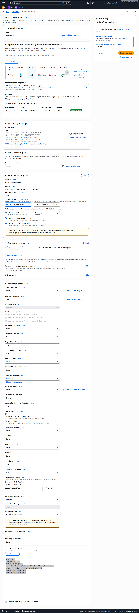

#### Check By Hitting the Public ips of both instances
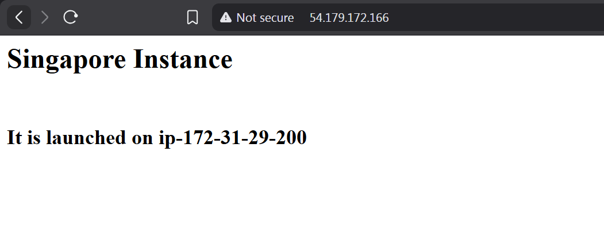
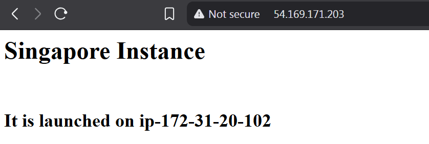
---

## 🔹 B. Mumbai Region (ap-south-1)

1. Switch region → Mumbai
2. Launch:

   * mumbai-india-instance
   * mumbai-us-instance
3. Same setup
4. Create web server for the  mumbai servers 
    ```bash
   #!/bin/bash 
   sudo apt update -y 
   sudo apt install nginx -y 
   echo "<h1> Mumbai  Instance </h1> <br> <h2> It is launched on $HOSTNAME </h2> " > /var/www/html/index.html 
   sudo systemctl enable nginx 
   sudo systemctl restart nginx
   ```

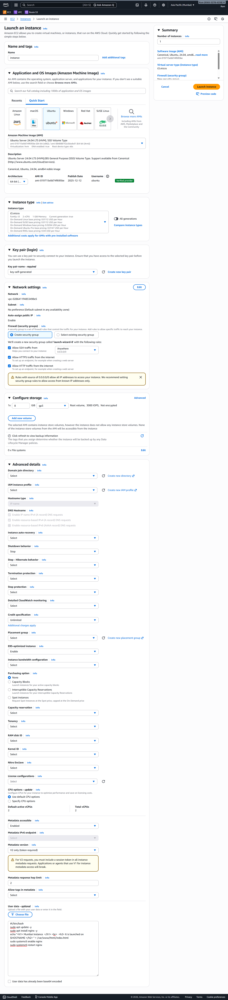

#### Ceck both the instance by pinging on their public ip
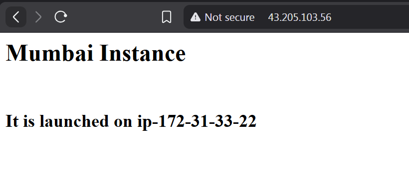
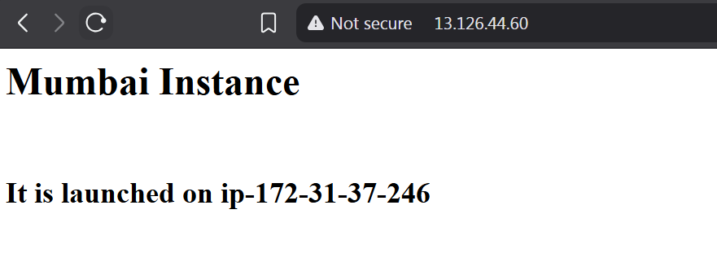 
---

# STEP 2 — Create Health Check (Singapore Failover)

1. Go → Route 53
2. Health Checks → Create Health Check
3. Choose:

   * Endpoint
   * Public IP of sg-primary
   * Protocol HTTP
   * Port 80
4. Save

Only attach health check to Primary record (not secondary).
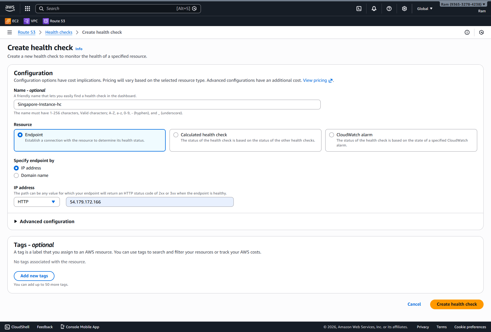
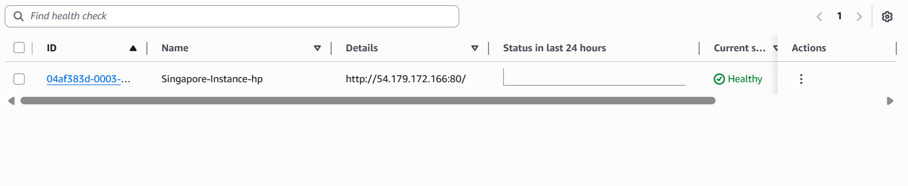
---


# STEP 3 — Create Hosted Zone

1. Route 53 → Hosted Zones
2. Create Hosted Zone
3. Public Hosted Zone
4. Domain name → your domain i.e `rampdhamdar.work.gd`

---
# Part -3  Creat Traffic Policy (tp-task-1)

Route 53 → Traffic Policies → Create Traffic Policy

Start Point:
A record → IPv4 address

---

## Level 1 – Weighted Routing (Root Level)

You created a **Weighted Routing Rule**

### Weight 1:

* 80%
* Connected to → Singapore Failover branch

### Weight 2:

* 20%
* Connected to → Mumbai Geolocation branch

Meaning:
Every DNS query:

* 80% probability → Singapore
* 20% probability → Mumbai

---

### Singapore Branch – Failover Routing

Under the 80% weighted branch you created:

Failover Routing Rule

Configured:

### Primary

* Endpoint: 54.179.172.166
* Attached Health Check
* Failover type: Primary
* 

### Secondary

* Endpoint: 54.169.171.203
* No health check
* Failover type: Secondary

Behavior:
If Primary healthy → all 80% traffic goes to Primary
If Primary unhealthy → that 80% traffic goes to Secondary

Failover only happens inside Singapore branch.

---

### Mumbai Branch – Geolocation Routing

Under the 20% weighted branch you created:

Geolocation Routing Rule

Configured:

### Location 1: India

* Endpoint: 43.205.103.56

### Location 2: United States

* Endpoint: 13.126.44.60

Behavior:

When traffic goes into the 20% bucket:

* If user DNS IP → India → send to India instance
* If user DNS IP → US → send to US instance

Important:
Geolocation ONLY applies to traffic that reaches that 20% branch.

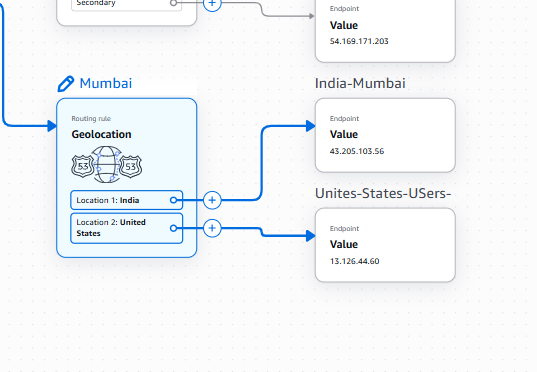

---

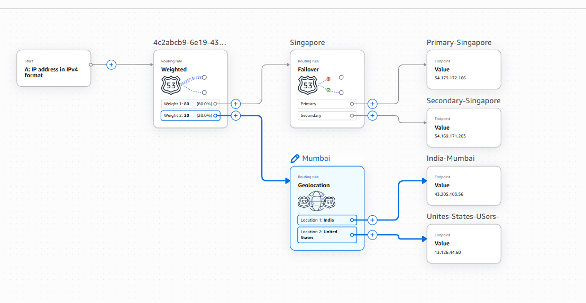

### Select Create Policy
### Select Hosted Zone
* Ensure no A Record  is in your Hosted Zone
* 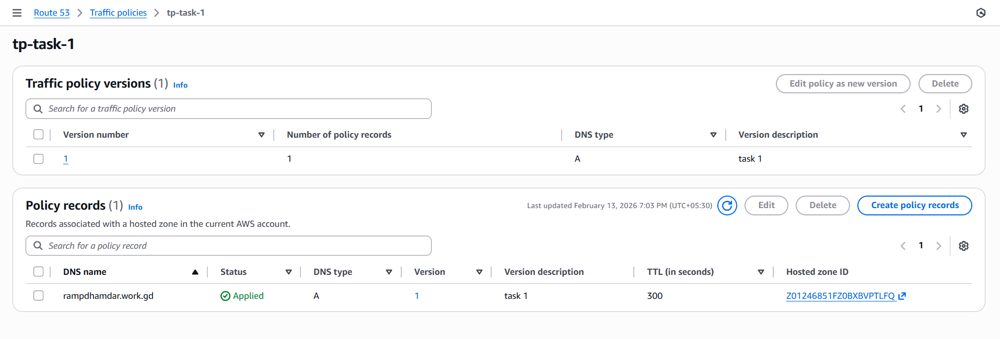
  

# Part -4 Verification step 

### try to ping your domain naturally
* You should most probably see the primary instance of Singapore region
* 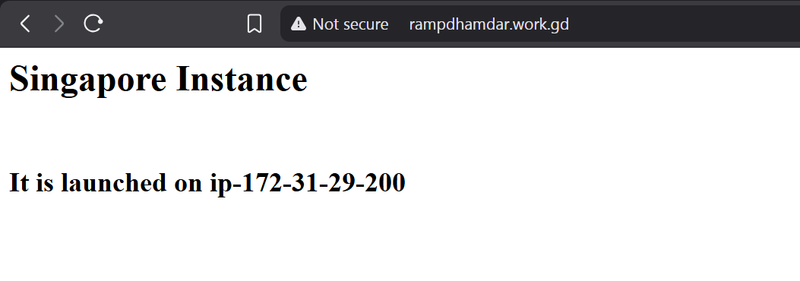
* Now Terminate the Primary-Instance of the Singapore Region
* And Wait For Health Check To be Unhealthy 
* 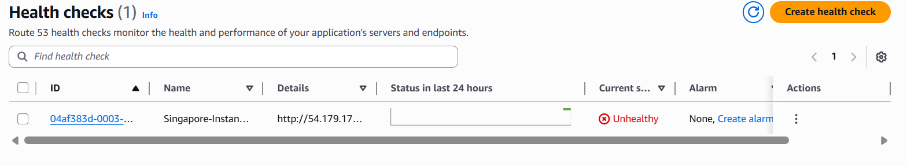
* Ping the domain again you most probably see the Secondary Instance of Singapore Region
* 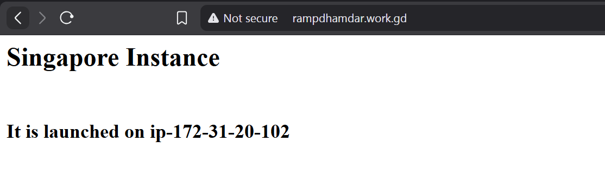
* Alternatively you can also see the India-Instance in the Mumbai Region 
* 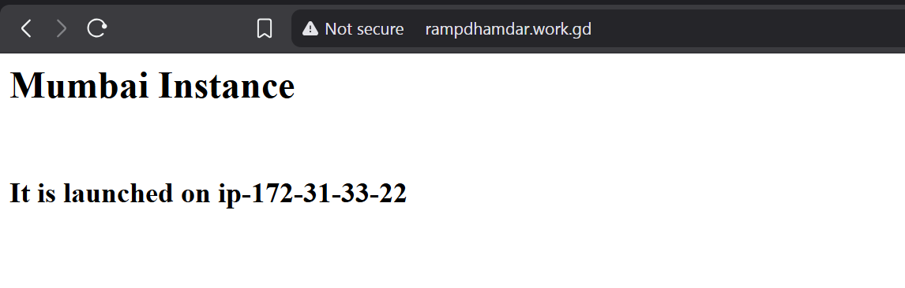
*  If you go to https://www.browserling.com/ and ping your domain you should see the INDIA-US Instance private ip 
*  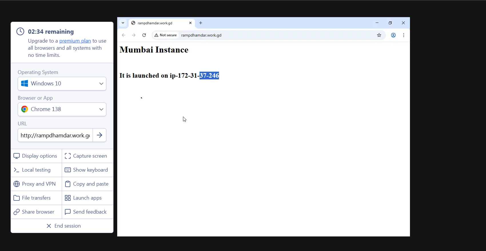


## ❌ Issues:

Your architecture sends US traffic to Mumbai region.

If US user hits Mumbai:
Latency ≈ 250–300 ms

Bad performance.

### ❌ Another Issue:

Singapore Failover only protects Singapore region.
But if whole Singapore region fails → Weighted still sends traffic to dead region.

Weighted routing does NOT detect region failure.

---

# 4️⃣ Major Flaws in Your Design

---

## 🚨 Flaw 1 — Mixing Routing Policies Incorrectly

You cannot combine:

* Weighted
* Failover
* Geolocation

at same DNS name directly.

Route 53 doesn’t allow nested routing like that unless carefully structured using different record names.

---

## 🚨 Flaw 2 — No Cross-Region Disaster Recovery

If:

* Mumbai region down → 50% traffic lost
* Singapore region down → 50% traffic lost

Weighted routing does NOT auto-remove failed region unless health checks used at weighted level.

---

## 🚨 Flaw 3 — Geolocation Logic Wrong

You're sending:

* US users → Mumbai
* India users → Mumbai

Why?

US users should ideally go to:

* US East (N. Virginia)
* US West (Oregon)

Sending US → Mumbai increases latency badly.

---

## 🚨 Flaw 4 — Failover Only Inside Singapore

Good internal redundancy.
But no cross-region failover.

---


# Final Verdict

Your current design:
✔ Good for learning routing policies
❌ Not optimal for performance
❌ Not production safe
❌ Incorrect geolocation strategy

If you want, I can redesign this into an interview-ready enterprise architecture diagram for you.
