High-level flow

1.  Create VPC in **Region A**

2.  Create VPC in **US Region**

3.  Create **cross-region VPC Peering**

4.  Update **route tables on both sides**

5.  Fix **security groups & NACLs**

6.  Launch **private EC2 instances**

7.  Test **private-IP connectivity**

No NAT, no Internet Gateway needed for this.

**Assumptions (adjust if needed)**

  --------------------------------------------
  **Item**         **Region A**  **US Region**
  ---------------- ------------- -------------
  Region           ap-south-1    us-east-1

  VPC CIDR         10.0.0.0/16   10.1.0.0/16

  Private Subnet   10.0.1.0/24   10.1.1.0/24
  --------------------------------------------

**CIDR must NOT overlap. If it overlaps, stop immediately.**

**STEP 1 --- Create VPC in Region A**

1.  Switch to **Region A**

2.  VPC → Create VPC

    - Name: ap-VPC

    - IPv4 CIDR: 10.0.0.0/16

    - 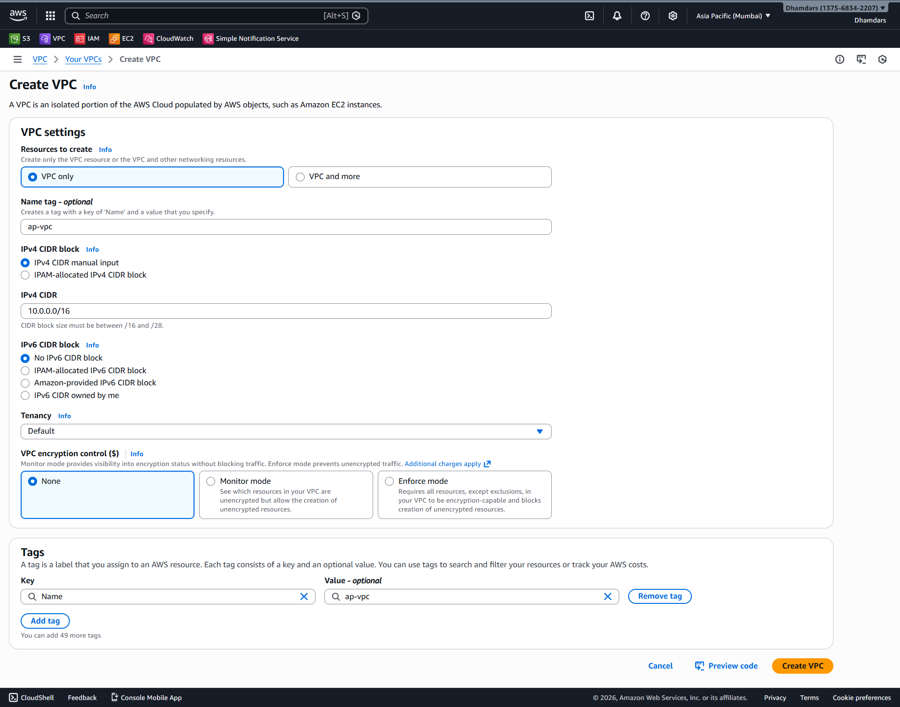{width="6.268055555555556in"
      height="4.922916666666667in"}

3.  Create **private subnet**

    - Subnet CIDR: 10.0.1.0/24

    - 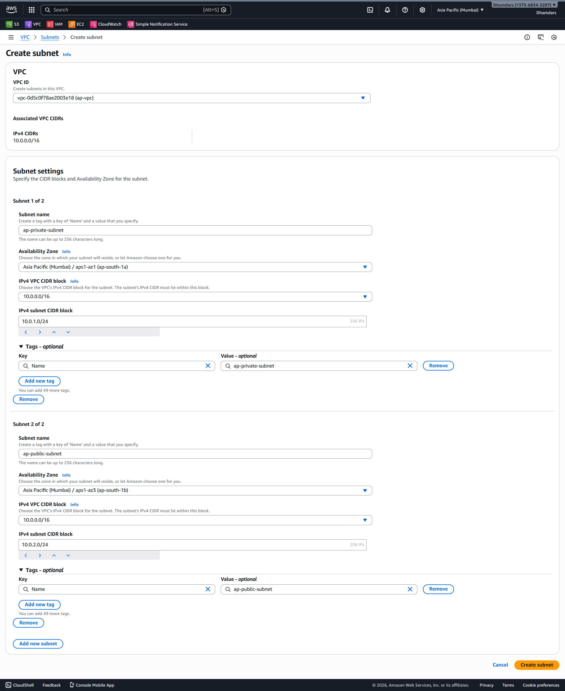{width="6.268055555555556in"
      height="7.659027777777778in"}

4.  Route table:

    - Create and Attach Internet Gateway route.

> 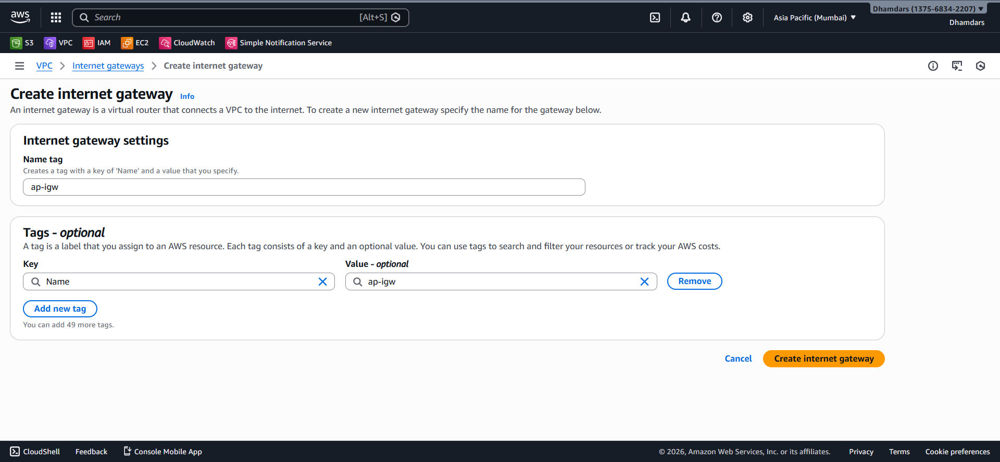{width="6.268055555555556in"
> height="2.8993055555555554in"}
>
> 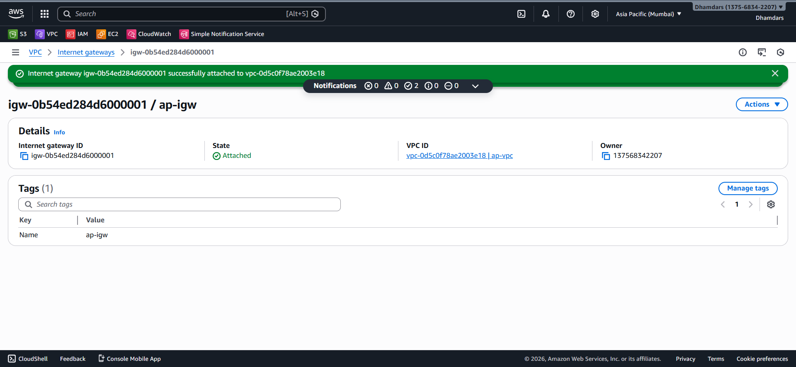{width="6.268055555555556in"
> height="2.8993055555555554in"}
>
> Edit the routes in the Default Route-table like the following
>
> 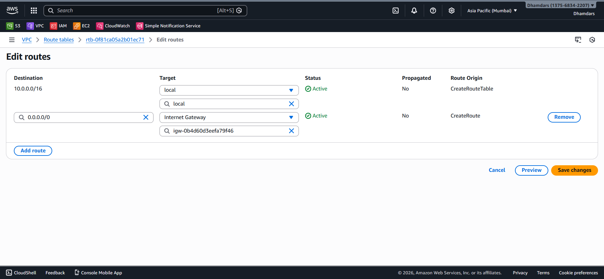{width="6.268055555555556in"
> height="2.8993055555555554in"}

This VPC is now ready.

**STEP 2 --- Create VPC in US Region**

Repeat same steps in **US Region**:

1.  Name: VPC-Region-B

2.  CIDR: 10.1.0.0/16

3.  No Internet Gateway route

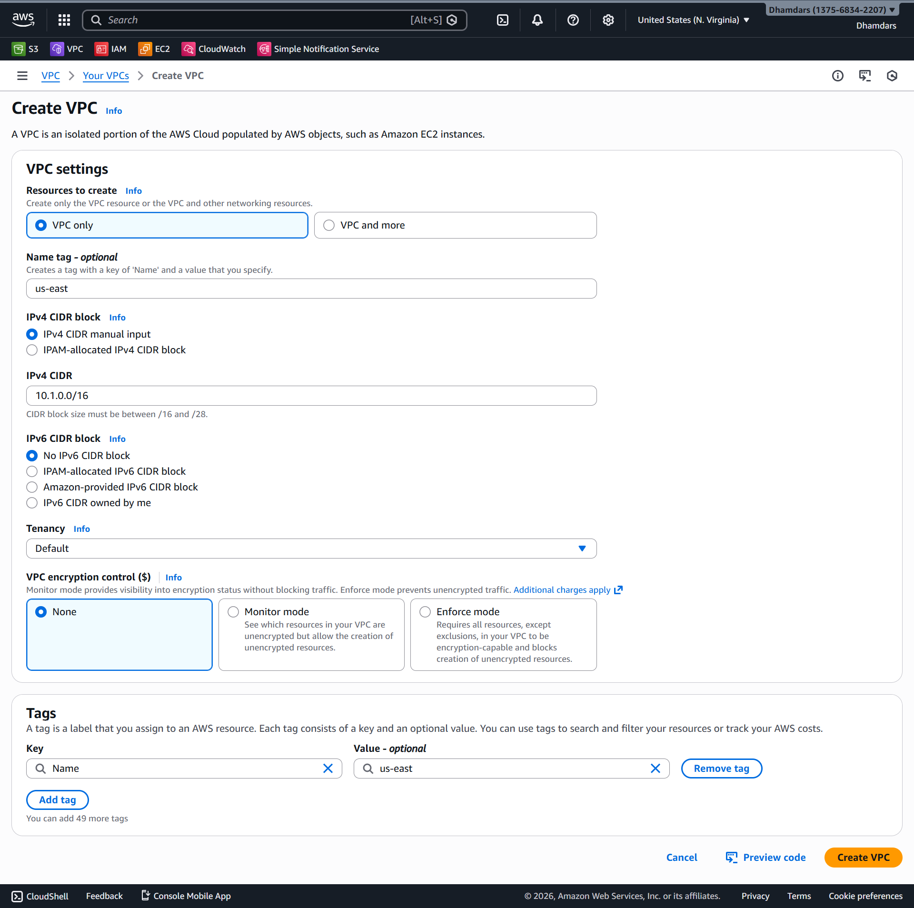{width="5.052974628171478in"
height="5.018825459317585in"}

4.  Private Subnet 10.1.1.0/24

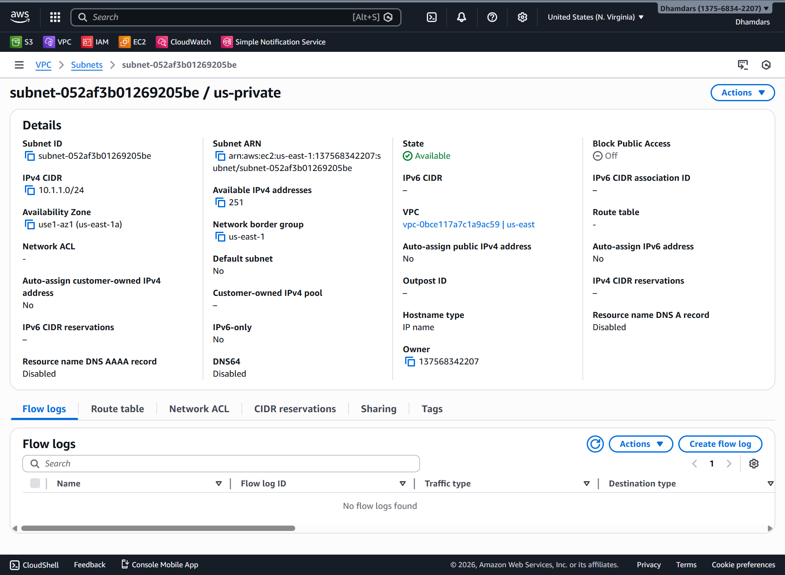{width="6.268055555555556in" height="4.6in"}

**STEP 3 --- Create Cross-Region VPC Peering**

Do this from **region 1 that is in Ap-vpc.**

1.  VPC → Peering connections → Create

2.  Requester:

    - VPC: ap-vpc

    - Region: us-east-1

3.  Accepter:

    - VPC: us-east 🡪 vpc-id

    - Region: us-east-1

4.  Create peering

> 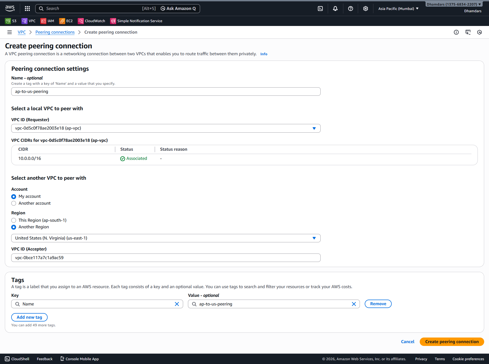{width="6.268055555555556in"
> height="4.668055555555555in"}

Now:

- Switch to US Region

- Accept peering request by Selecting the request 🡪 Actions 🡪 Accept
  request 🡪 Accept

> 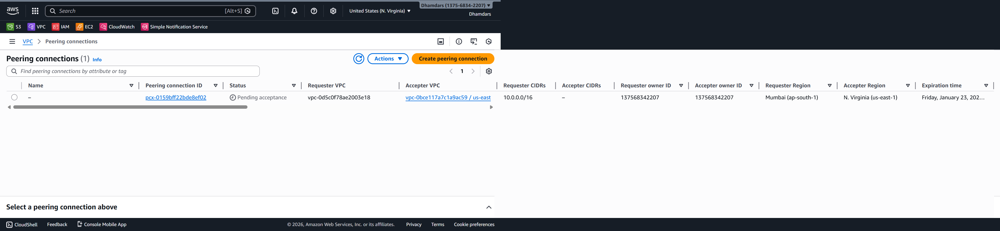{width="6.406944444444444in"
> height="1.4479166666666667in"}

Status must be **Active**.

**STEP 4 --- Route Tables**

**AP Region route table (private subnet)**

Add route:

- Destination: 10.1.0.0/16

- Target: **VPC Peering ID**

> 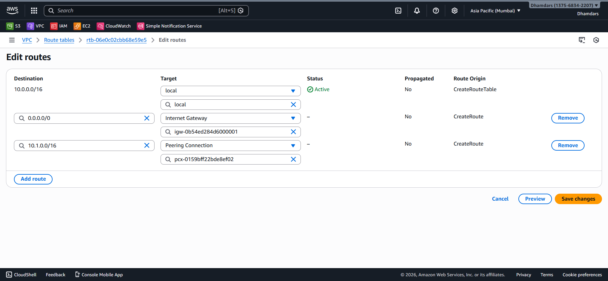{width="6.268055555555556in"
> height="2.8993055555555554in"}

**Us Region route table (private subnet)**

Add route:

- Destination: 10.0.0.0/16

- Target: **same Peering ID**

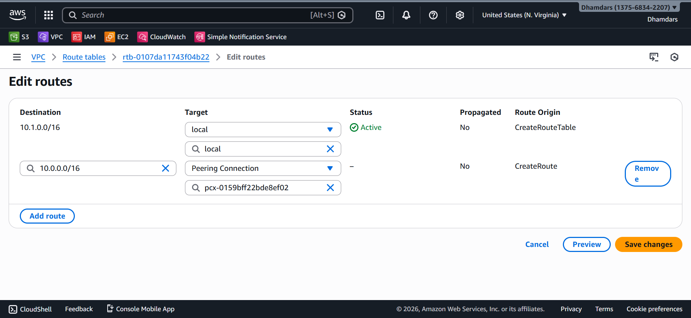{width="6.268055555555556in"
height="2.892361111111111in"}

If **either side is missing**, traffic dies silently.

**STEP 7 --- Launch Public Instances and take ssh of Private EC2
Instances in AP-Region.**

Launch 3 EC2 instances **in each private subnet**:

- No public IP for private instances and Public IP for Public Instances

- Ubuntu Linux

- Allow ssh in security group

- Public Instances

> 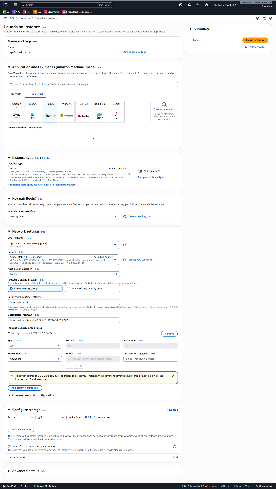{width="5.489583333333333in"
> height="9.693055555555556in"}
>
> AP-Private Instance
>
> 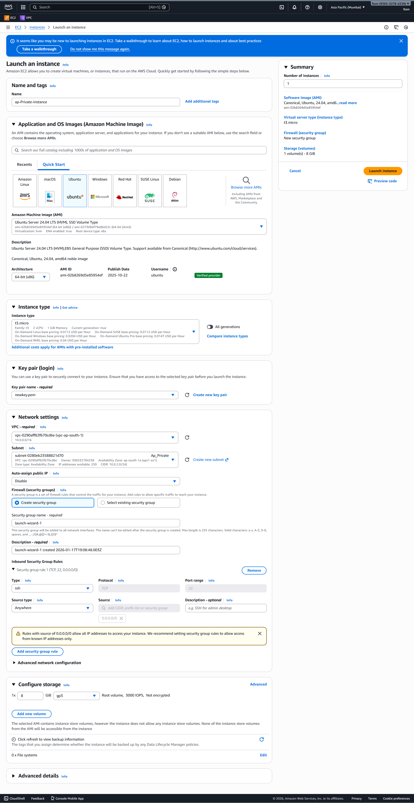{width="5.0055555555555555in"
> height="9.693055555555556in"}
>
> 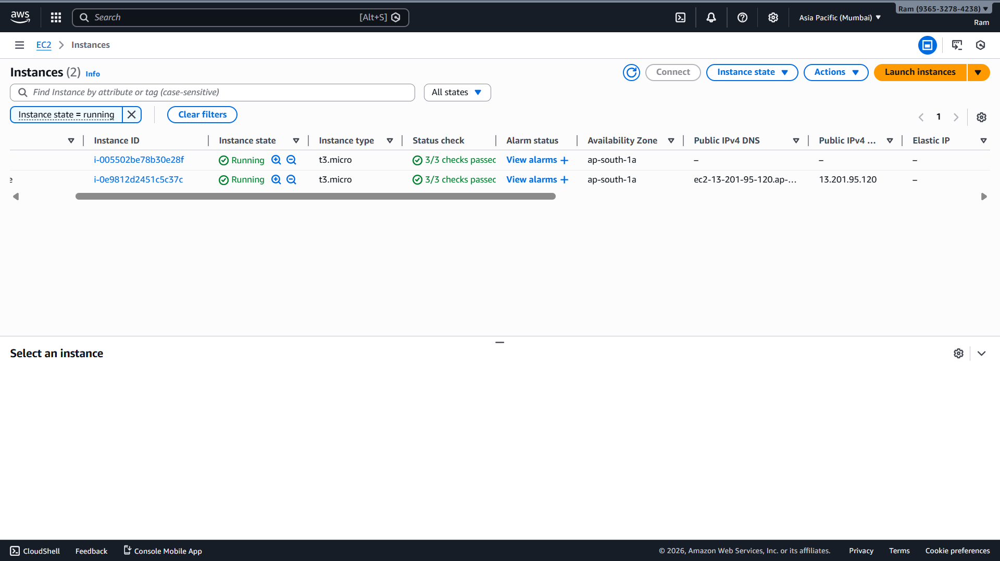{width="6.268055555555556in"
> height="3.522222222222222in"}
>
> Us- Instance
>
> 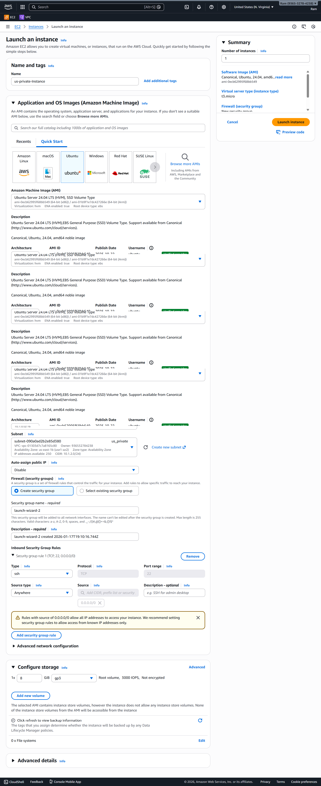{width="3.964583333333333in"
> height="9.693055555555556in"}

**STEP 8 --- Test Connectivity**

From Region A Public- instance:

ssh \<private-instance-of-ap-Region\> 🡪 ssh the private ip of us-region
private instance

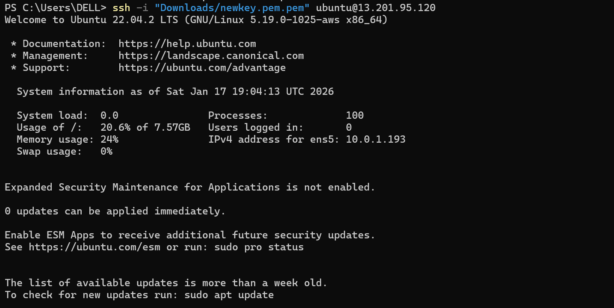{width="5.177130358705162in"
height="2.599463035870516in"}

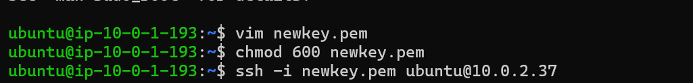{width="5.127378608923885in"
height="0.7558464566929134in"}

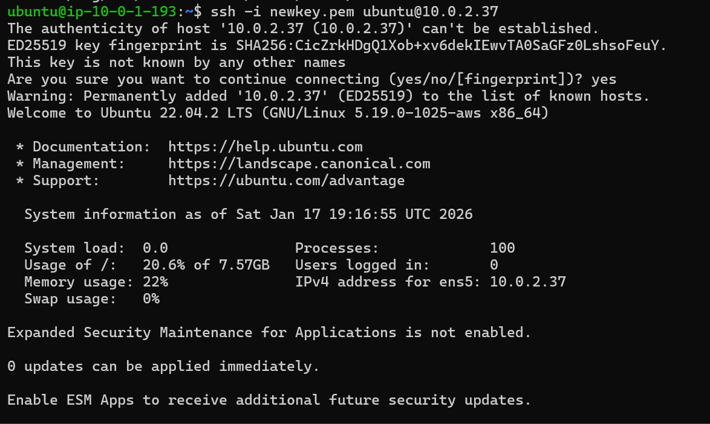{width="5.118951224846894in"
height="2.9405916447944005in"}

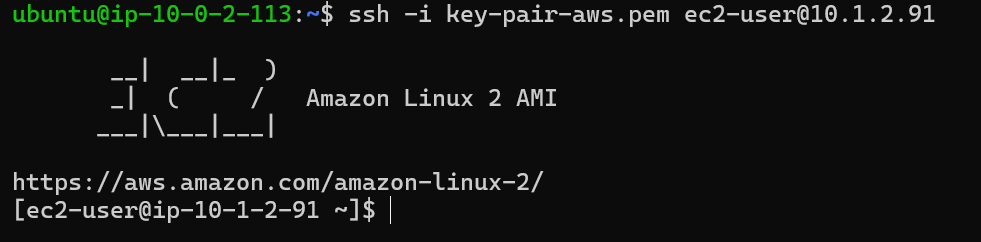{width="6.268055555555556in"
height="1.5458333333333334in"}
