# AWS Auto Scaling Group (ASG) with Step Scaling Example

## Project Overview

This project demonstrates how to set up an **Auto Scaling Group (ASG)** in AWS that automatically adjusts the number of EC2 instances based on **CPU utilization**.

* **Scale out** when CPU > 80%
* **Scale in** when CPU < 20%
* Instances run **Nginx** and have **HTTP port (80)** open
* Includes **user-data script** for automatic setup
* Verification steps included to ensure scaling works correctly

This setup helps maintain application availability while optimizing cost by automatically adjusting EC2 instances.

---

## Step 1: Launch Template

1. Open the **AWS Management Console → EC2 → Launch Templates → Create Launch Template**
2. Enter a **Name** (e.g., `nginx-asg-template`)
3. Select **AMI** (Amazon Linux 2 recommended)
4. Select **Instance Type** (e.g., `t2.micro`)
5. **Key Pair**: Select or create a key pair for SSH access
6. **Network Settings**: Open **HTTP (80)** in Security Group
7. **Advanced Details → User Data**:

```
#!/bin/bash
apt update -y
apt install nginx -y
echo "<h1>ASG Nginx Server</h1><p>Hosted on $(hostname)</p>" > /var/www/html/index.html
systemctl enable nginx
systemctl start nginx
```

8. Click **Create Launch Template**
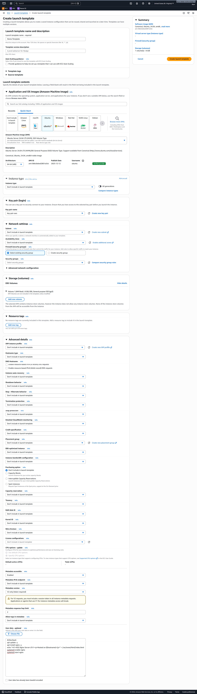

---


## Step 2: Create Auto Scaling Group (ASG)

1. Navigate to **EC2 → Auto Scaling → Auto Scaling Groups → Create ASG**
2. Choose the **Launch Template** created above
3. Set **Group Name** (e.g., `nginx-asg`)
4. Select **VPC & Subnets** (at least 2 subnets for high availability)
5. Configure **Group Size**:

   * Minimum: 1
   * Desired: 1
   * Maximum: 3
6. Attach to **existing security group** with HTTP 80 allowed
7. **Skip load balancer** if not required (optional)
8. Click **Next → Create ASG**

---

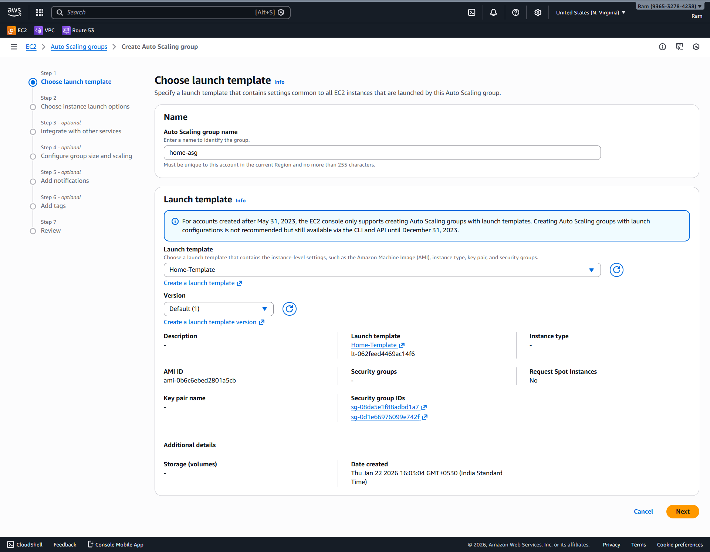
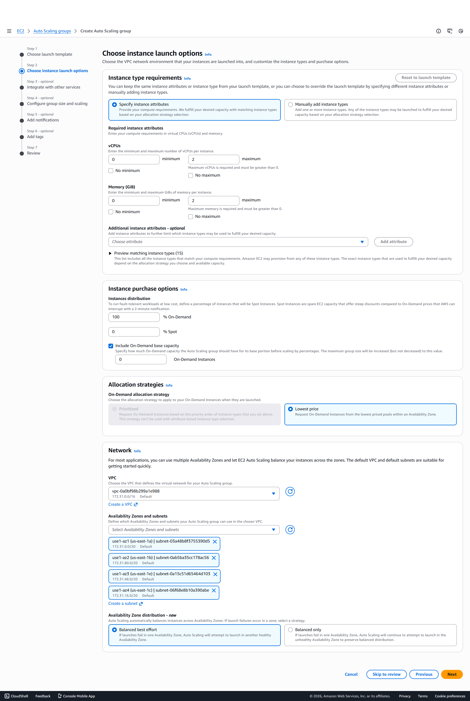

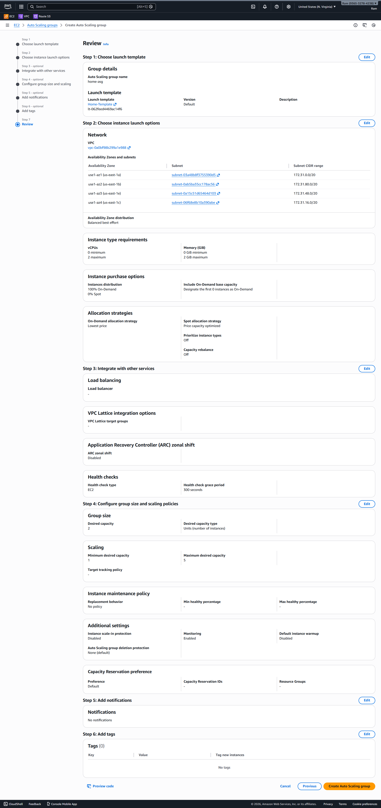
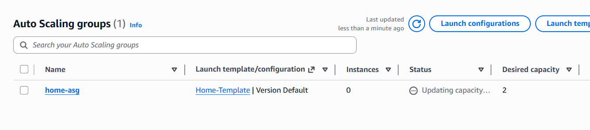

---

## Step 4: Create CloudWatch Alarms

1. Go to **CloudWatch → Alarms → Create Alarm**
2. **Select Metric → EC2 → Per-Instance Metrics → CPUUtilization**
3. **Scale Out Alarm**

   * Threshold: `>= 80%`
   * Period: `5 min`
   * Action: Attach **Scale Out Policy**
*
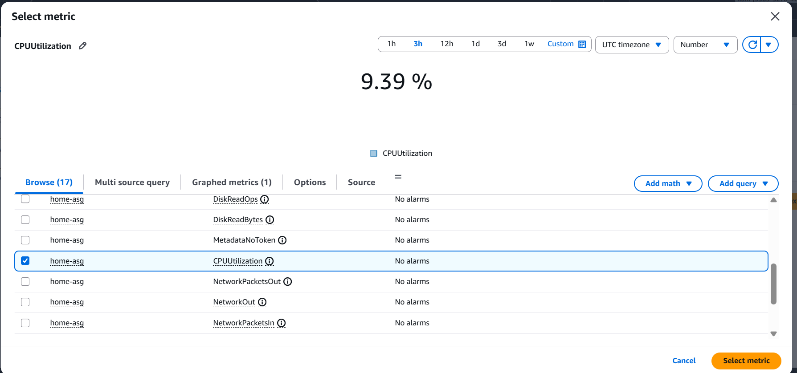


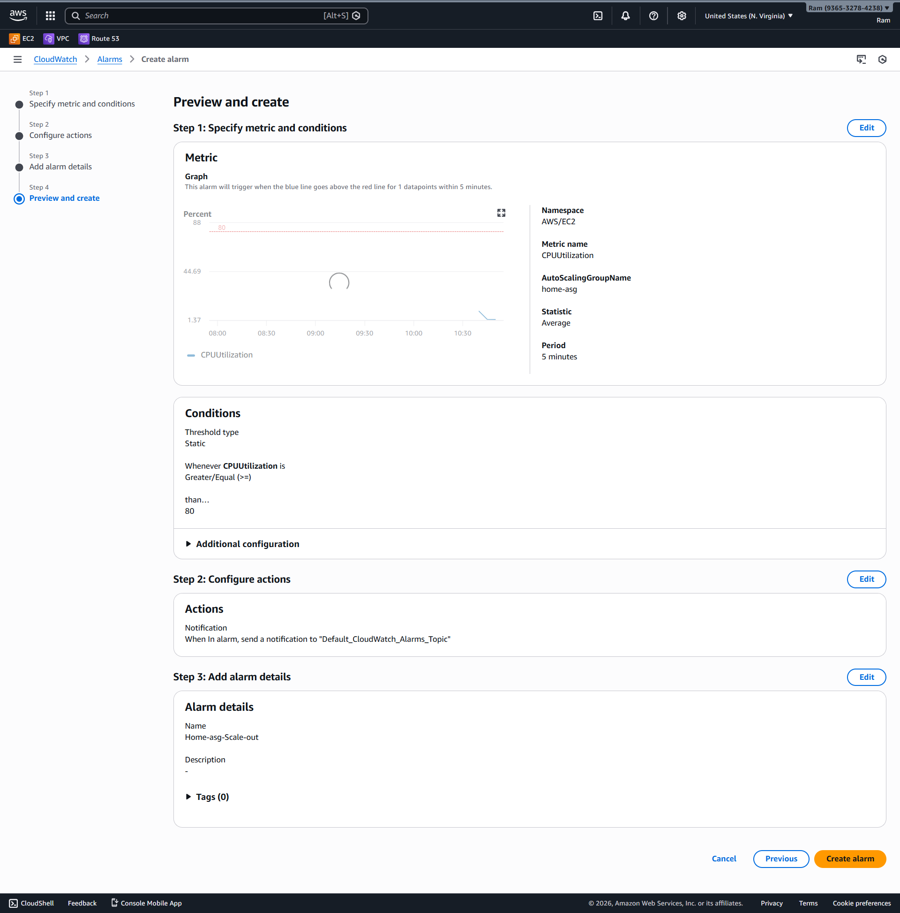

4. **Scale In Alarm**

   * Threshold: `<= 20%`
   * Period: `5 min`
   * Action: Attach **Scale In Policy**


---

## Step 3: Configure Step Scaling Policies

1. Navigate to your ASG → **Automatic Scaling → Add Policy → Step Scaling**
2. **Scale Out Policy**

   * Metric: `CPUUtilization`
   * Condition: `>= 80%`
   * Action: Add `1 instance`
   * Cooldown: `300 seconds`
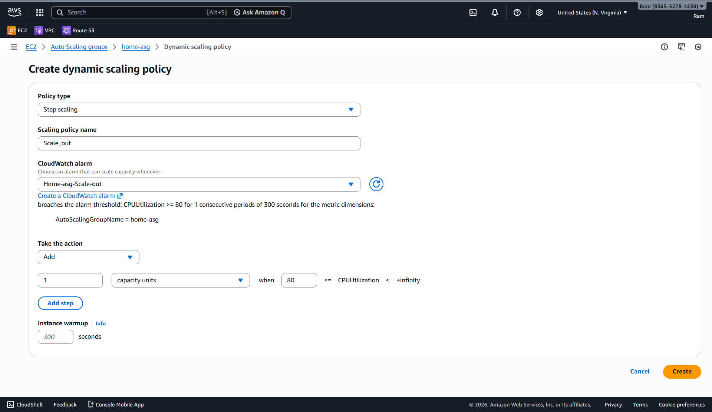

3. **Scale In Policy**

   * Metric: `CPUUtilization`
   * Condition: `<= 20%`
   * Action: Remove `1 instance`
   * Cooldown: `300 seconds`
4. Save both policies
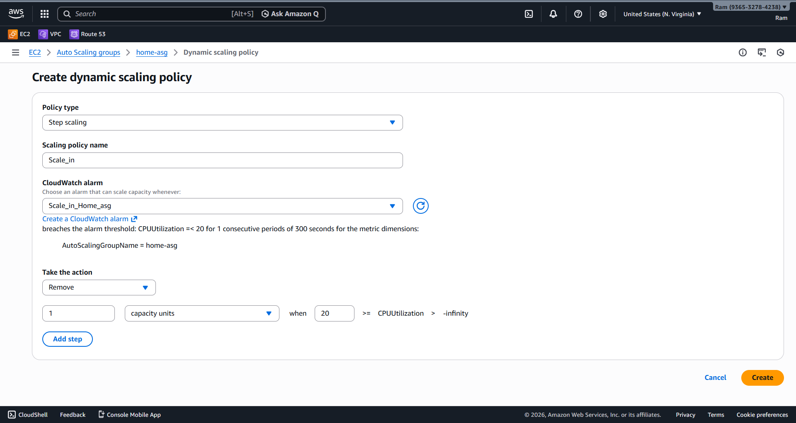
   
---

## Step 5: Verify ASG and Nginx

1. SSH into one of the instances using your key pair
2. Check **Nginx service**:

```
systemctl status nginx
curl http://localhost
```

3. Verify **HTTP response** from the instance public IP
4. Generate CPU load to test scaling:

```
yes > /dev/null &
```

5. Monitor **CloudWatch → Metrics → CPUUtilization**
6. Observe ASG **scale out/in actions** in **EC2 → Auto Scaling Groups → Activity History**
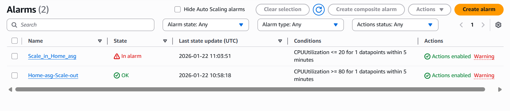
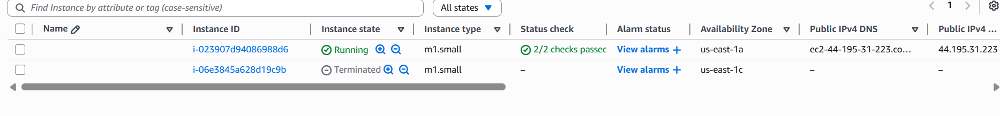
---

## Notes

* Ensure **security group allows HTTP (80)**
* Minimum 1 instance ensures availability
* Cooldowns prevent rapid scale in/out
* Step scaling allows multiple steps based on CPU thresholds

This setup ensures **dynamic scaling** with **automatic Nginx deployment**.
