**TASK-1 : S3 Static Object + SNS Notification**

**1️ Create S3 Bucket**

**Console → S3 → Create bucket**

- Bucket name: bucket-25-dec-2025 (must be globally unique)

- Region: **ap-south-1**

- **Uncheck** "Block all public access"

- Acknowledge warning

- Create bucket

> 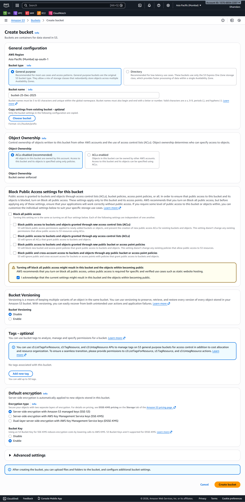{width="4.746527777777778in"
> height="9.693055555555556in"}

✅ **Verify**

- Bucket status = Created

- Region =ap-south-1

{width="6.268055555555556in"
height="3.1243055555555554in"}

**2️Public Access + Bucket Policy**

**Bucket → Permissions → Bucket policy**\
Paste (replace bucket name):

{

\"Version\": \"2012-10-17\",

\"Statement\": \[

{

\"Effect\": \"Allow\",

\"Principal\": \"\*\",

\"Action\": \"s3:GetObject\",

\"Resource\": \"arn:aws:s3:::bucket-25-dec-2025/\*\"

}

\]

}

Save.

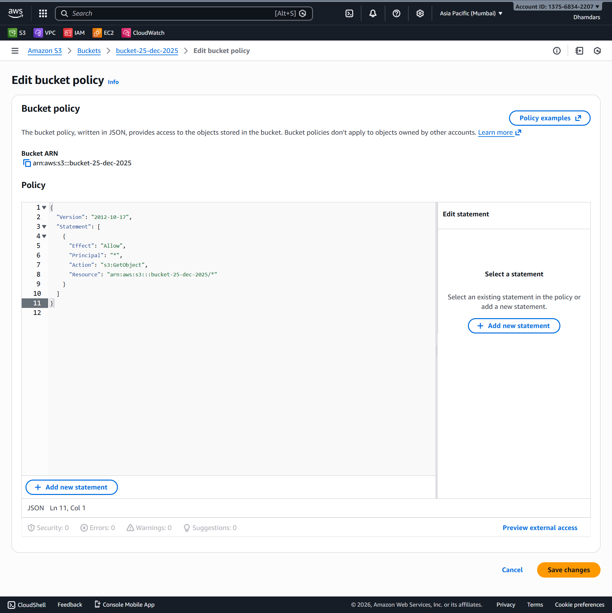{width="6.268055555555556in"
height="6.271527777777778in"}

✅ **Verify**

- No red error

- Public access = Objects readable

**3️ Create SNS Topic (S3 → SNS Notification)**

**SNS → Topics → Create topic**

- Type: Standard

- Name: s3-upload-alert

Create.

{width="6.268055555555556in"
height="7.315972222222222in"}

**SNS → Subscriptions**

- Protocol: Email

- Endpoint: *your email*

- Confirm subscription from email

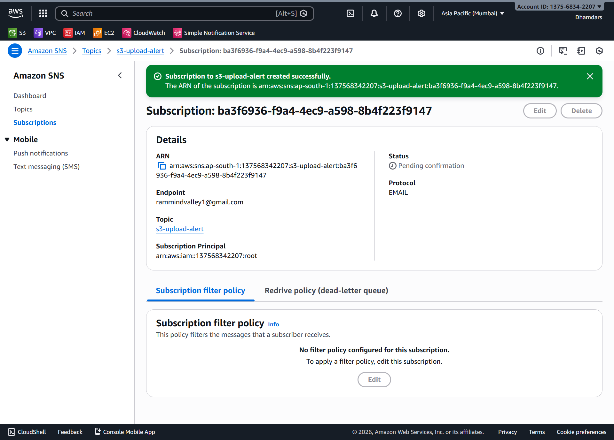{width="6.268055555555556in"
height="4.498611111111111in"}

**Attach SNS to S3**

**S3 → bucket-25-dec-2025 → Properties → Event notifications**

- Name: s3-upload-event

- Event type: **All object create events**

- Destination: SNS

- Topic: s3-upload-alert

- Save

{width="3.99375in"
height="9.693055555555556in"}

✅ **Verify**

- Subscription status = Confirmed

> 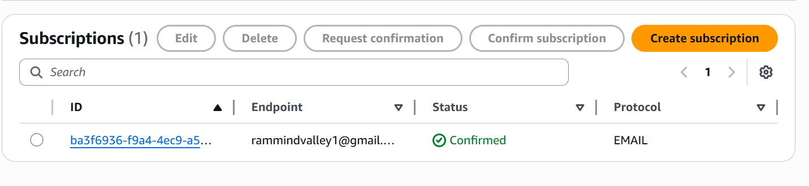{width="6.268055555555556in"
> height="1.445138888888889in"}

- Event rule
  visible{width="6.194444444444445in"
  height="1.2861111111111112in"}

**4️ Upload index.html**

Create file locally:

My auto web page is coming from

Upload to bucket.

{width="6.268055555555556in"
height="4.675in"}

✅ **Verify**

- Email notification received

> {width="5.522544838145232in"
> height="2.0252187226596674in"}

- Object visible

> {width="5.472222222222222in"
> height="0.8986111111111111in"}

- URL works:

<http://bucket-25-dec-2025.s3.amazonaws.com/index.html>

{width="4.836819772528434in"
height="1.98167104111986in"}

**TASK-2 : IAM ROLE**

**Create EC2 Role**

**IAM → Roles → Create role**

- Trusted entity: AWS service

- Use case: EC2

> {width="6.268055555555556in"
> height="7.1618055555555555in"}

Attach policies:

- AmazonS3FullAccess

- CloudWatchFullAccess

Role name: ec2-s3-cw-role

{width="6.268055555555556in"
height="8.052777777777777in"}

✅ **Verify**

- Trust relationship includes EC2

- Policies attached = 2

> {width="5.825366360454943in"
> height="1.4110487751531058in"}

**TASK-3 : VPC SETUP**

**1️ Create VPC**

CIDR: 10.0.0.0/16\
Name: MyVpc

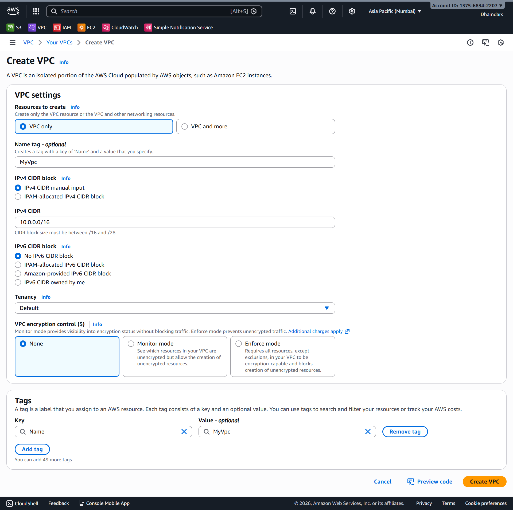{width="5.6568777340332455in"
height="5.618646106736658in"}

✅ **Verify**

- State = Available

**2️ Create IGW + Attach**

Name: MyIgw\
Attach to MyVpc

{width="5.670833333333333in"
height="3.170138888888889in"}{width="5.705555555555556in"
height="1.8555555555555556in"}

✅ **Verify**

- IGW attached

**3️ Create Public Subnets**

  ----------------------------------------------------------------
  **Subnet**         **CIDR**                **AZ**
  ------------------ ----------------------- ---------------------
  MyPub1             10.0.1.0/24             Ap-south-1a

  MyPub2             10.0.2.0/24             Ap-south-1b

  MyPub3             10.0.3.0/24             ap-south-1c
  ----------------------------------------------------------------

Enable **Auto-assign public IPv4**

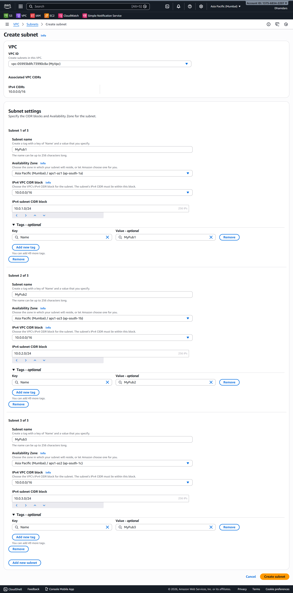{width="5.986111111111111in"
height="9.693055555555556in"}

**4️ Route Table**

Create RT: MyPubRt

Route:

0.0.0.0/0 → IGW

{width="5.916666666666667in"
height="2.4652777777777777in"}

Associate all 3 subnets.

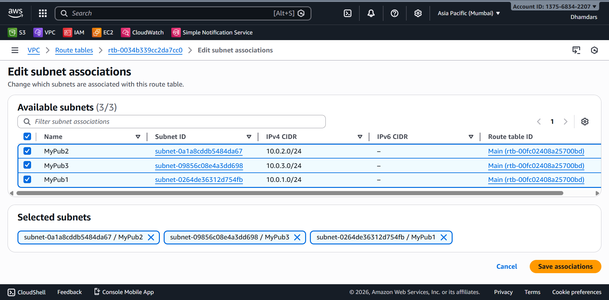{width="5.948611111111111in"
height="3.1013888888888888in"}

✅ **Verify**

- Explicit subnet association

**5️ Security Group**

**VPC 🡪 Security Groups**

Name: MySg_web_ssh

Inbound:

  --------------------------
  **Port**   **Source**
  ---------- ---------------
  22         0.0.0.0/0

  80         0.0.0.0/0
  --------------------------

Outbound: Allow all

{width="6.004166666666666in"
height="4.180555555555555in"}

✅ **Verify**

- Rules attached to VPC

**TASK-4 : USER DATA SCRIPT**

#!/bin/bash

sudo su

yum install -y httpd

sleep 5

aws s3 sync s3://bucket-25-dec-2025 /var/www/html/

sleep 5

echo \$(hostname) \>\> /var/www/html/index.html

systemctl restart httpd

systemctl enable httpd

**TASK-5 : LAUNCH TEMPLATE**

**EC2 → Launch Templates → Create**

- Name: mylaunch1

- AMI: Amazon Linux 2

- Instance: t3.micro

- IAM role: ec2-s3-cw-role

> {width="4.364013560804899in"
> height="1.115903324584427in"}

- Security Group: MySg_web_ssh

- User data: **paste script**

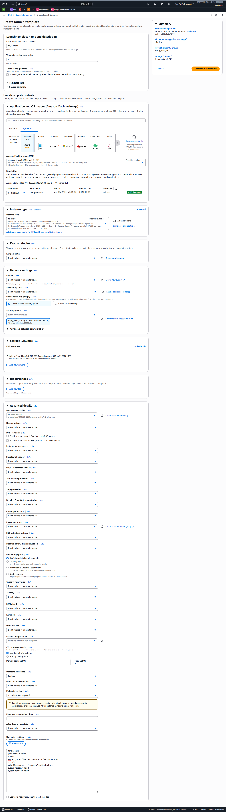{width="6.006944444444445in"
height="9.693055555555556in"}

**TASK-6 : AUTO SCALING GROUP**

**ASG → Create ASG**

- Launch Template: mylaunch1

- VPC: MyVpc

- Subnets: **All 3 public subnets**

- Desired: 2

- Min: 2

- Max: 4

> {width="5.4625in"
> height="9.693055555555556in"}

**TASK-7 : SCALING POLICIES + SNS**

**Create SNS Topic**

Name: scalealert

{width="6.268055555555556in"
height="6.081944444444445in"}\
Add email subscription → confirm

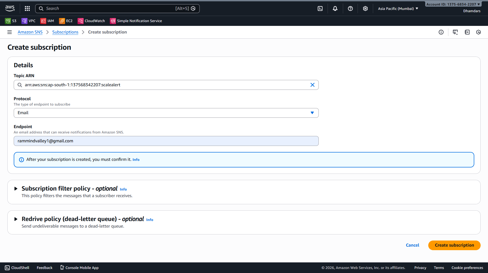{width="6.268055555555556in"
height="3.5125in"}

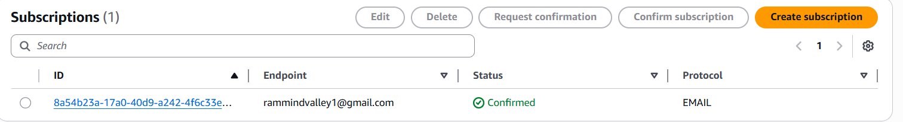{width="6.268055555555556in"
height="0.8541666666666666in"}

**Scale-Out Policy**

- MyAsg 🡪 Automatic Scaling 🡪 create dynamic scaling policy

- Policy type: Target Tracking

- Metric: Average CPU Utilization

- Target: **50%**

- {width="6.268055555555556in"
  height="4.991666666666666in"}

- Alarm → Notify SNS scalealert

**Scale-In**

- CPU \< 35%

- Cooldown: 300 seconds

✅ **Verify**

- CloudWatch alarms created

- SNS linked

> 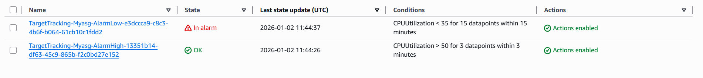{width="6.268055555555556in"
> height="0.6986111111111111in"}
>
> 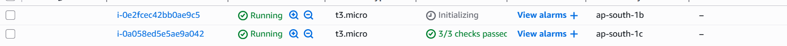{width="6.268055555555556in"
> height="0.37430555555555556in"}
>
> {width="6.268055555555556in"
> height="0.8298611111111112in"}

**TASK-9 : CLASSIC LOAD BALANCER**

**EC2 → Load Balancers → Create → Classic**

- MyCLB

- VPC: MyVpc

- Subnets: ALL

- SG: MySg_web_ssh

- **Do NOT register instances**

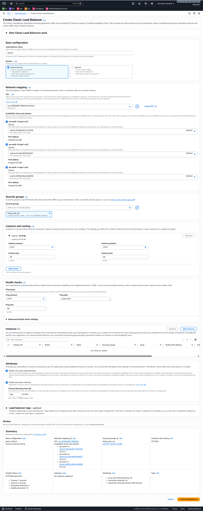{width="6.552463910761155in"
height="9.699922353455818in"}

Attach ELB to ASG:\
**ASG → Integrations 🡪 Load Balancing 🡪 Edit**

{width="6.268055555555556in"
height="2.8993055555555554in"}

✅ **Verify**

- ASG shows ELB attached

> {width="6.268055555555556in"
> height="0.4284722222222222in"}

- Health checks passing

> {width="6.048643919510061in"
> height="1.0789162292213472in"}

- Go to the url given by the Classic Load Balancer and check whether the
  load balancer is showing two or more instance type hostname

**TASK-10 : ROUTE 53**

1️⃣ Register domain in GoDaddy\
2️⃣ Create **Public Hosted Zone** in Route 53\
3️⃣ Update nameservers in GoDaddy

Create records:

- **A record** → Alias → ELB

- **CNAME** → ELB DNS name

✅ **Verify**

- dig domain resolves to ELB

**FINAL TESTING (MANDATORY)**

1️⃣ Open domain → see hostname-based output\
2️⃣ Refresh → different hostnames\
3️⃣ Terminate 1 EC2 manually\
4️⃣ Domain still works (1 hostname)\
5️⃣ Wait \~5 min → ASG launches new instance\
6️⃣ Refresh → 2 hostnames again\
7️⃣ Stress CPU (dd if=/dev/zero)\
8️⃣ 3rd instance launched\
9️⃣ SNS email received
